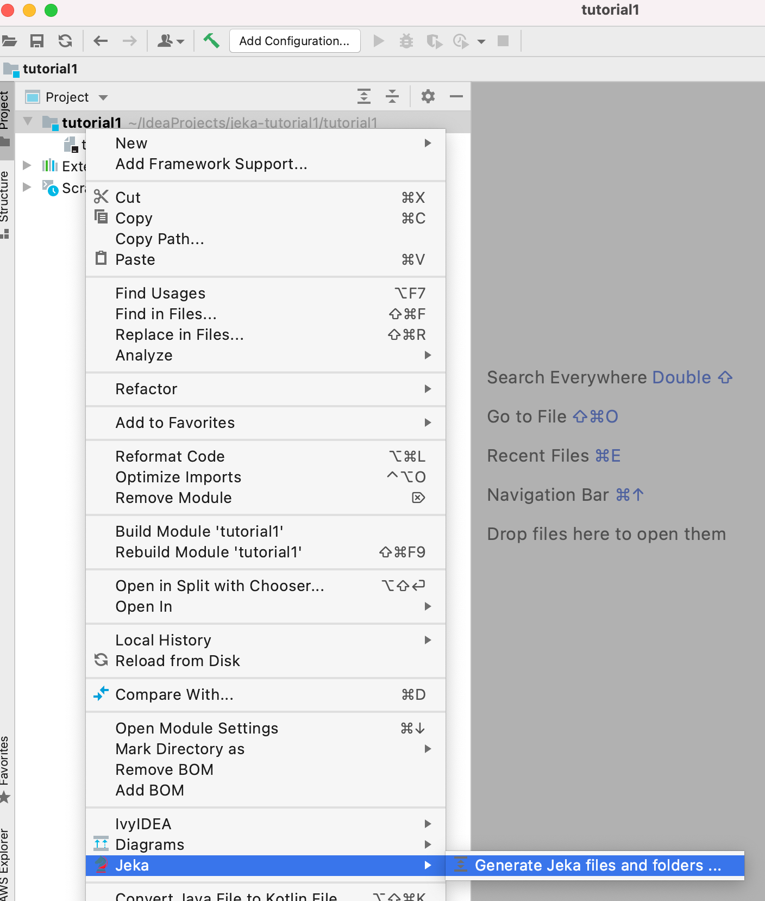
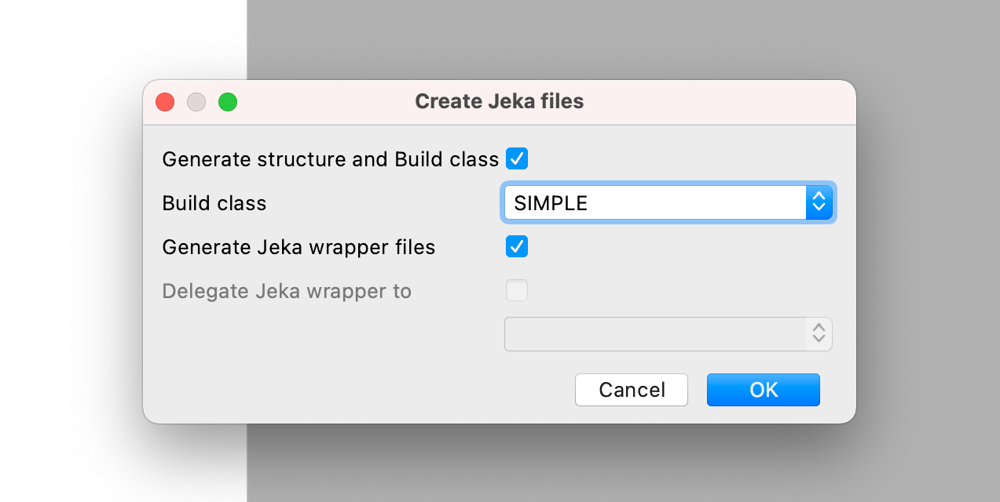
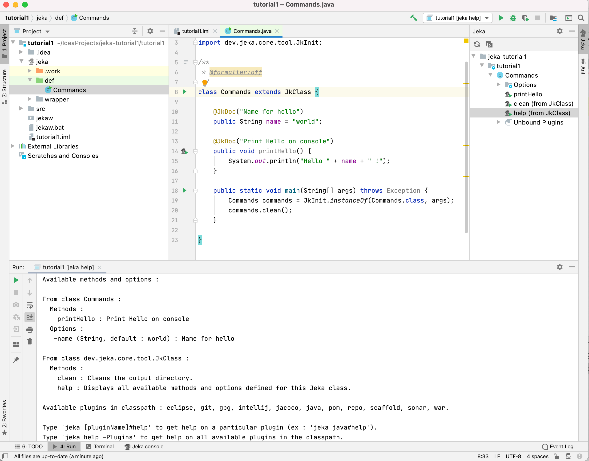
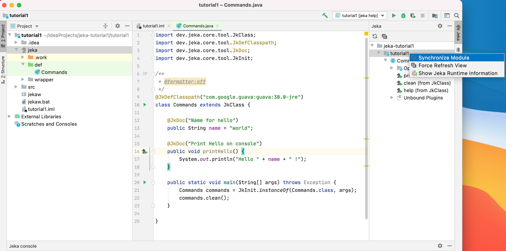
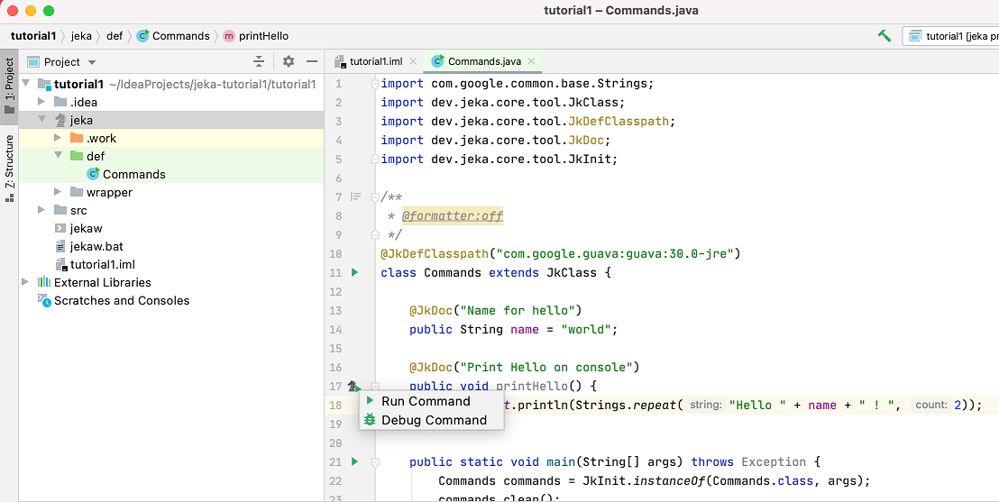
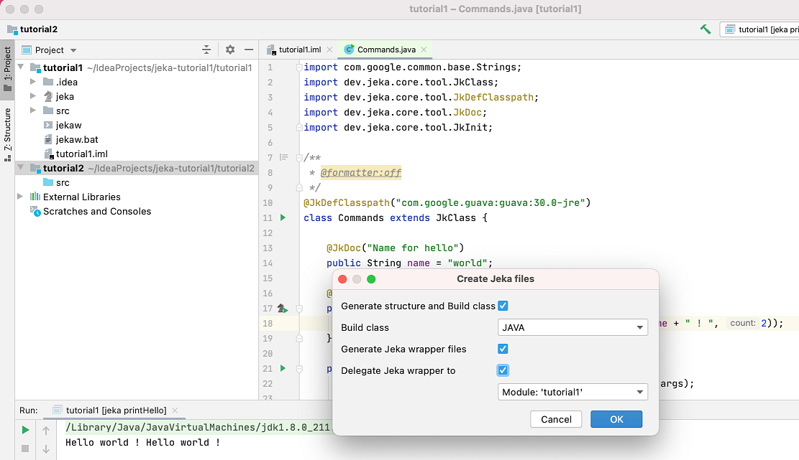
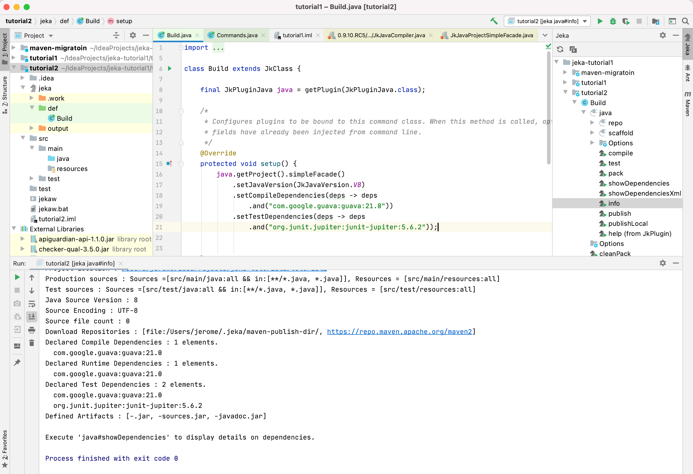
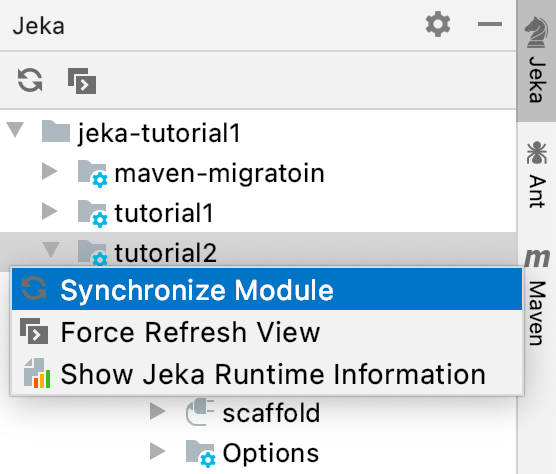

# Install Intellij Plugin

Install direcly plugin from [here](https://plugins.jetbrains.com/plugin/13489-jeka) 
or search 'jeka' in Intellij Marketplace

# Create a simple automation project

In this example, we will create a project to automate tasks (no Java project to build).

We will code simple functions that can executed both in IDE and in command line.

## Hello World !

Right click on folder or module > Jeka > Generate Jeka files and folders...

    
This opens a dialog box. Press OK.

    
This generates a Jeka folder structure with a empty Jeka class.

On the right side of your IDE, you can expand nodes to navigate on Jeka commands you can perform.

These commands come from either the JkClass or from plugin present in classpath.

Click Commands > help to trigger the `help` method coming from `JkClass`. 
This will display a contextual help for the available commands and options.
You can also invoke the help command using command line `./jekaw help`

You can now add your own commands just by declaring a public no-arg method returning `void`.

For adding options, just declare a public field as shown below.

The `helloWorld` command is invokable both from the IDE (run/debug) and from the command line using `./jekaw helloWorld -name=Joe`

You can write as many commands as you want in your Jeka class, and your project can also contain many Jeka class. 
The first Jeka class found is the default Jeka class (sorted by name/package). To run `doSomething` method on 
a class named `this.is.MyJekaCommands`a Jeka class, execute `./jekaw -JKC=MyJekaCommands doSomething`.

## Import 3rd Party libraries

Your Jeka classes can also use any third party libraries available on your file system or in a bynary repository.

Let's add *guava* to our Commands class : just add the `@JkDefClasspath` annotation and refresh ide module to 
make it available on IDE classpath.

    
Now you can use guava to improve your commands using *guava* inside.

    

# Build a Java Project

Jeka bundles Java project build capabilities. Of course, you can use your favorite build tool (Maven, Gradle, ...) 
beside Jeka in your project and let Jeka delegate builds to these tools, but you might prefer to let Jeka build 
your project by itself. Let's see how to do it.

Right click on folder or module > Jeka > Generate Jeka files and folders...

This opens a dialog box. Select *JAVA* and press OK.

The box *'delegate Jeka Wrapper to'* means that the module *tutorial-2* will reuse the same Jeka wrapper 
(and therefore the same Jeka version) than *tutorial-1*. That way, we can force all Java modules from a same Intellij 
project, to use the same Jeka Version, defined in one place.

    

This generates a Build template class in `jeka/def` along source folders.

You can launch directly any method declared on this class or navigate in Jeka right tool to discover methods available 
on this class or available plugin.

  
After modifying your dependencies, don't forget to refresh module in order intellij take it in account.

  
Now your project is ready to code. You'll find many project examples at https://github.com/jerkar/working-examples

# Make a plugin

A plugin is a collection of commands and options (meaning public no-args methods and fields) that can be bind to any 
JkClass in order to augment it or modify its behavior. 

For common usage, you don't need to write your own plugin but you will probably uses the ones that are bundled with 
Jeka. The simplest think to understand how it works, is to write your own one.

