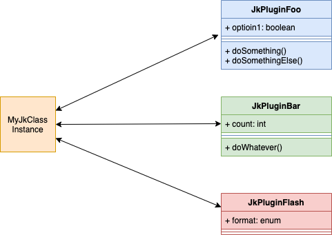

## Plugins

Jeka provides a pluggable architecture. In Jeka, a plugin is a class extending `JkPlugin` and named as *JkPlugin[PluginName]* (i.e. `JkPluginJava`for _java_ plugin).
The plugin name is inferred from Plugin class name.

Jeka is bundled with a bunch of plugins (java, scaffold, eclipse, intellij, ...), but one can add extra plugins just
by adding a plugin class to the _def classpath_ [in _def_ sources or as an external dependency](#RunClassPre-processing(Import3rdpartylibraryintoRunClasspath)).

To see all available plugins in the _def classpath_, just execute `jeka help`.

Each instantiated plugin is bound to a `JkClass` object with 1..1 relationship. There could not be 2 plugin instances of the same 
type bound to the same `JkClass` instance.



Plugins have 3 capabilities :
* Expose their own _Jeka methods_ and _options_ to command line.
* Access to their owning `JkClass` instance so to other plugins bound to it.
* Provide self documentation.

For example, [Jacoco Plugin](https://github.com/jerkar/jeka/blob/master/dev.jeka.core/src/main/java/dev/jeka/core/tool/builtins/jacoco/JkPluginJacoco.java)
does not provide _Jeka method_ but configures 'java' plugin in such unit tests are forked on a JVM with Jacoco agent on.
It also provides a utility class `JKocoJunitEnhancer` that supplies lower level features to launch Jacoco programmatically.

Some other plugins does not modify their owning Jeka class instance. For instance, [Scaffold Plugin](https://github.com/jerkar/jeka/blob/master/dev.jeka.core/src/main/java/dev/jeka/core/tool/builtins/scaffold/JkPluginScaffold.java)
just exposes methods to scaffold new Jeka projects.

### Invoking Plugin Methods and Options 

To invoke _foo_ plugin from command line, execute `jeka -foo#option1=false foo#doSomething`.

### Augmenting Plugins from Another Plugin. 

Plugins can access to other plugins of the same `JkClass` instance in order to extend them.

For example, _java_ plugin augment _scaffold_ pluging such it produces a Jeka class declaring 'java' plugin
when 'scaffold#run' is executed. It also creates Java project folders and files.

This is achieved using _JkPlugin_ lifecycle methods. Find documentation inside [JkPlugin](https://github.com/jerkar/jeka/blob/master/dev.jeka.core/src/main/java/dev/jeka/core/tool/JkPlugin.java).

### Self Documentation

Plugins uses same mechanism as `JkClass` to provide self-documentation. See example [here](https://github.com/jerkar/jeka/blob/master/dev.jeka.core/src/main/java/dev/jeka/core/tool/builtins/java/JkPluginJava.java)

### Binding Plugins Programmatically

Plugins can be explicitly declared in a _JkClass_ in order to be configured or invoked inside it.

```Java
import dev.jeka.core.tool.builtins.java.JkPluginJava;

public class MyBuild extends JkClass {

     JkPluginJava java = getPlugin(JkPluginJava.class); // This bind the 'java' plugin to MyBuild instances.

}
```

### Binding Plugins Dynamically

This is not necessary to declare a plugin in `JkClass` in order to invoke it. 
It can be done dynamically from the command line.

For example, `jeka scaffold#run java#` will :
* Bind Java plugin to the running _JkClass_ instance (if not declared yet)
* Invoke `run` method of the _scaffold_ plugin.
This will result in scaffolding a Java project for Jeka. If `java#` was ommited, it would 
  result in a scaffold of a simple automation project.
  

### Plugin Lifecycle

There are 3 places where you can configure plugins :
* In `JkClass` constructor : at this point options has not yet been injected, so it's the place to configure default option values.
* In `JkClass#setup` : at this point, options has been injected.
  This is the place to configure plugins and other instance members.
* In `JkClass#postSetup` : at this point, plugins has done their configuration job. So it is the place
  to override plugin settings, if needed.

Plugin authors can leverage plugin lifecycle plugin to perform configuration before or after 
the setup is invoked. See [JkPlugin](https://github.com/jerkar/jeka/blob/master/dev.jeka.core/src/main/java/dev/jeka/core/tool/JkPlugin.java) for further details

```Java
public class MyBuild extends JkClass {
    
    private JkPluginSonar sonarPlugin = getPlugin(JkPluginSonar.class);  // Bind sonar plugin 

    @Override
    public setup() {
        sonarPlugin.prop(JkSonar.BRANCH, "myBranch");  // define a default for sonar.branch property
    }
```
[Jeka own build class](https://github.com/jerkar/jeka/blob/master/dev.jeka.core/jeka/def/dev/jeka/core/CoreBuild.java) makes a good example.


### Plugin Version Compatibility 

As Jeka API is likely to evolve (less and less), plugin authors can mention the Jeka lower version 
in MANIFEST entry `Jeka-Lowest-Compatible-Version` of the plugin jar.

It is also possible to mention the highest version on Jeka, a plugin version is compatible with.
As this information is unknown at the time of publishing the plugin, a mechanism based on a central registry 
keeps track this information.

It consists of publishing a specific format flat file on a url. The url may be mentionned in MANIFEST 
entry `Jeka-Breaking-Change-Url` of the plugin jar.
The file contains the versions that start breaking compatibility.
Project repository might host this registry.

A working example is available for  [spring-boot plugin](https://github.com/jerkar/springboot-plugin).
The `breaking_versions.txt` is accessible at https://raw.githubusercontent.com/jerkar/springboot-plugin/master/breaking_versions.txt
declared in `JkPluginSpringboot` as :

