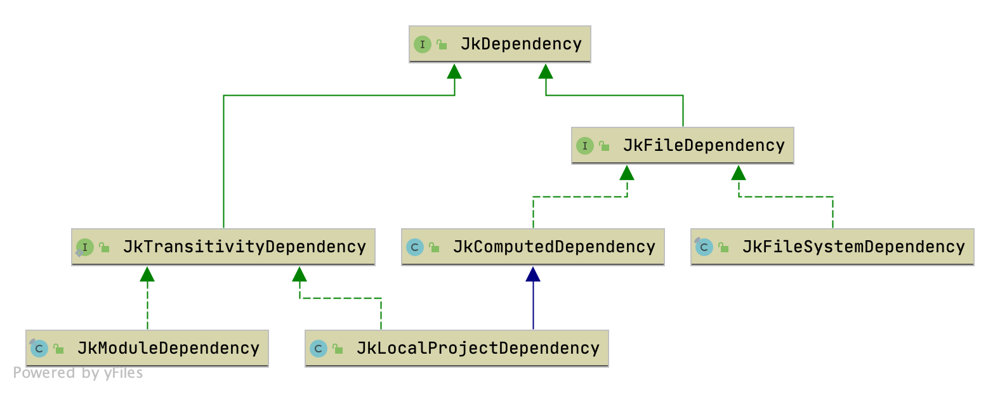

# Welcome to Jeka

Jeka is a general-purpose build tool designed as a library. In other words, users describe programmatically 
the actions needed to achieve automation tasks, as they would do for regular code.

The library is designed to make complex common tasks as compiling, testing or resolving dependencies as concise as possible,
so building projects may require less typing compare to other tools you may know, with simplicity and transparency as 
a bonus.

_Jeka_ automation code can be run indifferently from IDE (via classic `main` method) or command line, thanks 
to a bundled lean and fast execution engine. This engine comes with a small set of concepts promoting simplicity,
flexibility and re-usability.

## Execution engine

### Jeka directory content 

By convention, every project automated or built by Jeka contains a _jeka_ directory at its root (_[Project Root]/jeka_). 
This directory contains everything _Jeka_ needs to automate or build the project.

In this directory, you may find :
  * __def__ (directory - optional) : User _Java_ and/or _Kotlin_ sources that will be executed by the execution engine.
  * __output__ (directory - generated) : Files produced by the tasks (jar files, classes, test reports, doc, ...)
  * __boot__ (directory - optional) : 3rd-party jar files users may add to be used by code located in *def*.
  * __wrapper__ (directory - optional) : Wrapper jar file for bootstrapping a specified version of Jeka.
  * __.work__ (directory - generated): Temp files generated by Jeka execution engine as compiled classes from _def_.
  * __options.properties__ (file - optional) : Contains properties defined at project level.
  * __cmd.properties__ (file - optional) : Contains predefined command shortcuts that can be invoked with a single keyword.

Depending on your needs, feel free to store any build related elements in this directory (keys, document templates,...).

Besides, project root may also contains _jekaw_ and _jekaw.bat_ shell scripts to invoke _Jeka_ wrapper conveniently.

For the following, when we refer to the command `jeka`, you can use `./jekaw` indifferently.
All command lines are supposed to be launched from the root of the project (and not from _[Project Root]/jeka_).

### What is Jeka wrapper

Jeka wrapper consists in shell scripts, a thin booting jar and a configuration file in order _Jeka_ can be executed on a specified 
version without being installed on the host machine. This is the recommended way of using _Jeka_ as it makes  builds 
portable from one machine to another.

* __jekaw__ and __jekaw.bat__ are respectively _Unix like_ and _Windows_ scripts to launch bootstrapping jar.
* __jeka/wrapper/dev.jeka.core-wrapper.jar__ is the bootable jar in charge of downloading and installing the specified Jeka 
  version on the host machine prior to launch _Jeka_
* __jeka/wrapper/wrapper.properties__ specifies the _Jeka_ version to use.

### What is inside _[User Home]/.jeka_

_Jeka_ automatically creates a directory  _[User Home]/.jeka_ when running for the first time. This directory may contain
* __options.properties__ (file - optional) : Properties defined at global level (see later section).
* __cache__ (directory - generated) : Various files cached by Jeka as downloaded files and specifically dependency artifacts. This directory can be safely deleted.
* __maven_publish_dir__ (directory - generated) : Contains artifacts that your projects have published locally respecting Maven repository standards
* __ivy_publish_dir__ (directory - generated) : Contains artifacts that your projects have published locally respecting Ivy repository standards

In the contrary of Maven, _Jeka_ does not publish locally on the same repository where are downloaded dependency artifacts.

### Setup _Jeka_

__Note :__ _Jeka_ organization provides a [plugin](https://plugins.jetbrains.com/plugin/13489-jeka/) to make the following
tasks smoother or transparent. Here, we'll focus only on how to do it using command line.

__Prerequisite :__ You need a JDK 8 or higher installed on your machine. By default, _Jeka_ will use the _Java_ executable 
found in your _PATH_ environment variable. See later sections for changing this default.

There is two ways of using _jeka_ : by installing _Jeka_ itself of by using a template project containing the _Jeka_ wrapper.

#### Install _Jeka_

* Download the latest release from [here](https://search.maven.org/search?q=g:%22dev.jeka%22%20AND%20a:%22jeka-core%22)
  and unpack the _distrib.zip_ wherever you want on your machine. We'll refer to this directory as [JEKA HOME].
* Add [JEKA HOME] to your _PATH_ environment variable.
* Now, you can now use `jeka` command from everywhere.

#### Or use a Template Wrapper Project

* Clone template blank project from https://github.com/jerkar/blank-template-project.git
* Now, you can use `jekaw` command from your local directory.

#### Setup IDE

* Add an IDE _path variable_ ***JEKA_USER_HOME*** pointing on _[USER HOME]/.jeka_. In _Intellij_ :  **Settings... | Appearance & Behavior | Path Variables**
* If you use `jeka` instead of `jekaw`, add an IDE _path variable_ ***JEKA_HOME*** pointing on [JEKA HOME].

### Basic Project 

In first instance, we'll focus on how execution engine works. For simplicity's sake, we'll use trivial examples.
Concrete real-life cases, as building projects, will be documented in specific sections.

#### Create Project Structure

* Create the root dir of the project or use the _template wrapper project_ mentioned above. 
* At project root, execute `jeka scaffold#run scaffold#wrap` (or just `jekaw scaffold#run` if using the template wrapper project).
* Execute `jeka intellij#iml` or `jeka eclipse#files` in order to generate IDE configuration file. 
* The project with a _Jeka_ structure and a basic build class is ready to work within your IDE

Execute `jeka -h` (or simply `jeka`) to display a contextual help on the console.

### KBeans

_KBean_ is the central concept of execution engine. It consists in classes sharing characteristics :
* Extending `JkBean`
* May declare `public void` methods taking no arguments. All these methods are invokable from command line.
* May declare `public` fields _(aka KBean properties)_. These field values can be injected from command line.
* May override `init` method to perform specific initialisation tasks.
* May override `postInit` method to perform tasks once all KBeans has been initialized.
* They are supposed to be instantiated by the execution engine and not from user code. 
 .

_KBeans_ can be declared in _def_ directory as source file or just be present as classes in classpath (see later).

* KBean methods can be invoked from command line as`jeka [kbeanName]#methoName [kbeanName]#[propertyName]=xxx` or 
from the IDE using a basic `main` method (see later).
* Many methods/properties can be invoked in a single command line.
* _[kbeanName]#_ prefix can be omitted. By default, it will be resolved on the first KBean found in _def_ dir.  

In a given project, there can only be one _KBean_ instance per _KBean_ class, but if you work with a multi-project
build there can be several in classpath (one per project).

Generally _KBeans_ interact with each other inside their `init` method. They access each other using `getRuntime().getRegistry().get(MyBean.class)`.

When a _KBean_ depends on another one, it's good to declare it as an instance property of the first bean as this 
dependency will be mentioned in the quto-generated documentation.

#### Create a Basic KBean

* Create a class extending `JKBean` in _def_ source dir.
* Declare a public field of a simple type (String, boolean, int, float, enum, date, composite objects of simple types).
    It can be declared with a default value (e.g. `public int yourFieldName = 3;`).
* Declare a `public void` method taking no arguments. Implement it in a way it depends on the declared field.
* Execute `jeka yourMethodName yourFiedName=5` on console at root of you project. It runs !

___Extras___
* Annotate class, fields and methods with `@JkDoc` to provide help support.
* Execute `jeka help` to see _KBean_ description in help console. 
* _def_ may contain several classes. They can be helpers or other _KBEANS_. If you want a class not to be compiled, name it with a leading '_'.
* Fields can be annotated with `@JkInjectProperty("my.prop.name")` to inject the value of a _property_ in.
* For more details about accepted field injected types, see `dev.jeka.core.tool.FieldInjector#parse` method.
* _KBean_ properties can also been nested composite objects, see example in `dev.jeka.core.tool.builtins.project.ProjectJkBean#pack` field.

#### 3rd party dependencies

Jeka embeds a bunch of utilities to perform build related tasks (file/zip manipulation, git, launching processes, compilation, testing, dependency management, crypto, ...) 
nevertheless, you may want rightfully to use some 3rd-party dependencies.

* One way is to add directly jar files to _jeka/boot_ directory.
  * Add jar files to _jeka/boot_ directory.
  * Execute `jeka intellij#iml` or `jeka eclipse#files`.
  * Now, you can use added libraries in your code.
* Another way is to annotate your build class with `@JkInjectClasspath` mentioning either a module coordinate (e.g. _org.seleniumhq.selenium:selenium-remote-driver:4.0.0_) or a path on the local file system.
  * Annotate your build class as mentioned.
  * Execute `jeka intellij#iml` or `jeka eclipse#files`.
  * Now, you can use declared libraries along their dependencies in your code.
  * Be aware that a dependencies imported via `@JkInjectClasspath` annotation is imported for all build classes and not only for annotated class.
* The last way is to add it at execution time by mentioning either a module coordinate or a file path in the command line using '@' as in `@my.org:a-jeka-plugin:1.0.0`.

#### Import _KBean_ from other Projects

In multi-project build, it's quite common that a _KBean_ accesses to a _KBean_ instance coming from another project. 
You can achieve it in a statically typed way.

* In _master_ _KBean_, declare a field of type `JkBean` (e.g. ´JkBean importedBuild;`). It doesn't have to be public.
* Annotate it with `@JkInjectProject` mentioning the relative path of the imported project (e.g. `@JkInjectProject("../anotherModule")).
* Execute `jeka intellij#iml` or `jeka eclipse#files`.
* Redefine the declared type from `JkBean` to the concrete type of imported _KBean_
* Now, master _KBean_ can access the imported _KBean_ in a static typed way.
* See example [here](https://github.com/jerkar/jeka/blob/master/dev.jeka.master/jeka/def/MasterBuild.java).
* Be careful that the imported _KBean_ deals with file paths using `JkClass#getBaseDir` in order it can be safely executed from any working directory.

#### Launch and Debug from the IDE

There's 2 ways of launching or debugging _Jeka_ builds from IDE. We don't mention here, usage of [Intellij plugin](https://github.com/jerkar/jeka-ide-intellij).

##### Create a `main` Method inside your _def_ Classes

Create one or many main methods as :
```
 public static void main(String[] args) {
        JkInit.instanceOf(CoreBuild.class, args).cleanPack();
    }

    public static class Release {
        public static void main(String[] args) {
            JkInit.instanceOf(MasterBuild.class, args, "-runIT").release();
        }
    }
```
Build classes (inheriting `JkClass`) must be instantiated using `JkInit#instanceOf` in order it be setup in proper state.

The arguments passed in `main` method are interpreted as command line arguments.

Launching or debugging this way is performant as all build classes and their dependencies are already on classpath. Therefore, no compilation or dependency resolution is needed.

Be careful to launch the _main_ method using _module dir_ as _working dir_. On _IntelliJ_, this is not the default (it uses _project dir_).

To change _intelliJ_ defaults, follow : *Edit Configurations | Edit configuration templates... |  Application | Working Directory : $MODULE_DIR$*.

##### Configure an IDE Launcher 

Sometimes, you may need to mimic closer the command line behavior, for debugging purpose or to pass '@' arguments.

* Create an IDE launcher for a Java Application
* Set `dev.jeka.tool.Main` as Java main class.
* Set the same command line arguments as you would do for invoking from command line (Do not include _jeka_ command).

### More about KBeans

When executing, Jeka will first determine the _default KBean_ to instantiate it. The _default KBean_ is 
determined as follows :
1. The _KBean_ mentioned in command line `-kb=` option.
2. The first _KBean_ found in _def_ dir according the fully qualified class name alphabetical order.

The _KBean instantiation_ consists in :
1. Call the constructor
2. Inject properties in _KBean_ fields
3. Call its `init`method.

The `init` method of the _default KBean_ can, in turn, inkove oth

### Properties

Properties are pairs of String  _key-value_ that are used across Jeka system. It typically carries urls, local paths,
tool versions or credentials. They can be globally accessed using `JkProperties#get*` static method.

Properties can be defined at different level, in order of precedence :
* System properties : Properties can be defined using system properties as `-DpropertyName=value`. System properties can
  be injected from Jeka command line.
* OS environment variables : Properties can also be defined as OS environment variable.
* Project : Defined in _[Project Root]/jeka/project.properties_. Used typically for storing tool version (e.g. `jeka.kotlin.version=1.5.21`).
* Global : Defined in _[User Home]/.jeka/global.properties_ file. Used typically to define urls, local paths and credentials.

Standard properties :
* `jeka.jdk.X=` location of the JDK version X _(e.g. jeka.jdk.11=/my/java/jdk11)_. It is used to compile projects when 
  project JVM target version differs from Jeka running version.
* `jeka.repos.download.url` : Base url of the repository used to download dependencies (see later)
* `jeka.kotlin.version` : Version of Kotlin used for compiling both _def_ and project Koltlin sources.

### Useful commands 

_Jeka_ comes with predefined methods coming either from `JkClass` or built-in plugins. 

* `jeka` : Displays on console methods and options invokable from command line, along plugins available in the classpath.
* `jeka [pugin-name]#help` : Displays on consoles all methods and option invokable for the specified plugin (e.g. `jeka scaffold#help`).
* `jeka intellij#iml` : Generates iml file for Intellij. It is generated according the dependencies declared for this project.
* `jeka intellij#iml -JKC=` : If the above fails cause your def classes do not compile, using `-JKC=` avoids def compilation phase.
* `jeka eclipse#files` : Same purpose as above to generate metadata files for Eclipse.
* `jeka scaffold#run` : Generates files for creating a basic Jeka project from scratch.
* `jeka scaffold#wrap` : Generates wrapper files (jekaw/jekaw.bat and bootstrap jar)
* `jeka scaffold#run java#` : Generate files for creating a Jeka project for building a JVM language project

### Useful standard options

You can add these options to you command line.

* `-kb=[KBeanName]` : By default, Jeka instantiates the first _KBean_ found under _def_ directory to execute methods on. 
  You can force to instantiate a specific class by passing its long or short name. 
  If the class is already in classpath, then no _def_ compilation occurs.
  Using simply `-JKC=` is equivalent to `-JKC=JkClass` which is the base class bundled in Jeka.
* `-lri` : Displays runtime info. This will display on console meaningfull information about current Jeka version, Java version, base directory, download repository, classpath, ...
* `-lsu` : Shows logs about jeka setup (compilation of def classes, plugin loading, ...).These informations are not logged by default.
* `-ls=BRACE` : Alters console output by delimiting tasks with braces and mentioning the processing time for each.
* `-ls=DEBUG` : Alters console output by showing the class name and line number from where the log has been emitted.
* `-lv` : Alters console output by displaying trace logs (emitted by `JkLog#trace`)
* `-dcf` : Force compilation of _def_ classes, even if they are marked as up-to-date.

### How to change the JDK that will run _Jeka_

To determine the JDK to run upon, _jeka_ looks in priority order at :
* _JEKA_JDK_ environment variable ([_JEKA_JDK_]/bin/java must point on _java_ executable)
* _JAVA_HOME_ environment variable 

If none of these variables are present, _jeka_ will run upon the _java_ executable accessible from your _PATH_ environment.

### How to change the repository _Jeka_ uses to fetch dependencies 

By default, _jeka_ fetch dependencies from maven central (https://repo.maven.apache.org/maven2).

You can select another default repository by setting the `jeka.repos.download.url` options. 
We recommend storing this value in your [USER DIR]/.jeka/options.properties file to be reused across projects.

For more details, see `JkRepoFromOptions` javadoc.


## The Build Library

Jeka contains a library for all regular things you need to build/test/publish projects..
The library does not depend on the execution engine and has zero dependency. 

### API Style

_Jeka_ tries to stick with a consistent API design style.

* All Jeka public classes/interfaces start with `Jk`. The reason is for easing distinction, in IDE, between classes supposed be used
  in production or test and the ones used for building. It also helps to explore Jeka API.
* As a rule of thumb _Jeka_ favors immutable objects for shallow structures and
[parent-chaining trees](https://github.com/djeang/parent-chaining/blob/master/readme.md) for deeper ones.
Both provide a fluent interface when possible.
* All objects are instantiated using static factory methods. Every factory method names start with `of`.
* All accessor method names (methods returning a result without requiring IO, only computation) starts with `get`.
* To create a subtly different object from another immutable one, _Jeka_ provides :
  * Methods starting with `with` when a property is to be replaced by another.
  * Methods starting with `and` when a collection property is to be replaced by the same one plus an extra element.
  * Methods starting with `minus` when a collection property is to be replaced by the same one minus a specified element.
* To modify a mutable object, _Jeka_ provides :
  * Methods starting with `set` to replace a single property value by another.
  * Methods starting with `add` to add a value to a collection property.
  Those methods return the object itself for chaining.

### Domains Covered by the API

The previous example demonstrates how the Java/project API can be used to build and publish Java projects. This API
relies on other lower level ones provided by _Jeka_. In a glance these are the domains covered by the _Jeka_ APIs :

* __Files :__ File trees, filters, zip, path sequence
* __System :__ Launching external process, Logging, Meta-info
* __Cryptography :__ PGP signer
* __Dependency management :__ Dependency management, publishing on repositories
* __Java :__ Compilation, javadoc, resource processor, manifest, packager, classloader, classpath, launching
  * __Testing :__ Launching tests and get reports
  * __Project :__ Project structure to build
* __Tooling :__ Eclipse integration, intellij integration, Maven interaction, Git
* __Support :__ Set of utility class with static methods to handle low-level concerns


### Files

File manipulation is a central part for building software.
Jeka embraces JDK7 *java.nio.file* API by adding some concepts around, to provide a powerful fluent style API performing
recurrent tasks with minimal effort.

The following classes lie in `dev.jeka.core.api.file` package:

* `JkPathFile` A simple wrapper for files (not folders). It provides copying, interpolation, checksum, deletion and creation methods.

* `JkPathSequence` An Immutable sequence of `java.nio.file.Path` providing methods for filtering or appending.

* `JkPathMatcher` An immutable `java.nio.file.PathMatcher` based on `java.nio.file` glob pattern or regerxp.
  Used by `JkPathTree` to filter in/out files according name patterns.

* `JkPathTree` An Immutable root folder (or a zip file) along a `PathMatcher` providing operations to copy, navigate, zip or iterate.
  This is a central class in Jeka API.

* `JkPathTreeSet` An Immutable set of `JkPathTree`. Helpful to define set of sources/resources and create jar/zip files.

* `JkResourceProcessor` A mutable processor for copying a set of files, preserving the structure and
  replacing some text by other text. Typically, used for replacing token as `${server.ip}` by an actual value.

Examples

```Java
// creates a file and writes the content of the specified url.
JkPathFile.of("config/my-config.xml").createIfNotExist().replaceContentBy("http://myserver/conf/central.xml");

// copies all non java source files to another directory preserving structure
JkPathTree.of("src").andMatching(false, "**/*.java").copyTo("build/classes");

// One liner to zip an entire directory
JkPathTree.of("build/classes").zipTo(Paths.get("mylib.jar"));

```

### System

The `dev.jeka.core.api.system` package provides system level functions :

* `JkInfo` Provides meta information as the running version of Jeka.

* `JkLocator` Provides information about where is located repository cache or Jeka user home.

* `JkLog` Provides API to log Jeka event. It supports hierarchical logs through `#startTask`
  and `#endtask` methods.

* `JkProcess` Launcher for external process.

* `JkPrompt` One-liner to ask user input.

### Dependency Management

Dependency management API let define, fetch and publish dependencies. Api classes belong to `dev.jeka.core.api.depmanagement` [package](https://github.com/jerkar/jeka/blob/master/dev.jeka.core/src/main/java/dev/jeka/core/api/depmanagement)

#### Concepts

##### Dependency

For Jeka, a _dependency_ is something that can be resolved to a set of files by a `JkDependencyResolver`.
Generally a dependency resolves to 1 file (or folder) but it can be 0 or many.

A dependency is always an instance of `JkDependency`.

Jeka distinguishes mainly 3 types of dependency :

* __Arbitrary files__ located on the file system (represented by `JkFileSystemDependency` class). These files are assumed to be present on the file system when the build is running.
* __Files produced by a computation__ (represented by `JkComputedDependency` class). These files may be present on file system or not. If they are not present, the computation is run in order to produce the missing files. Generally the computation stands for the build of an external project.
* __Reference to module__ (represented by `JkModuleDependency`) hosted in a binary repository (Ivy or Maven for instance) : Jeka can consume and resolve transitively any artifact located in a repository as you would do with Maven, Ivy or Gradle.

For the last, Jeka is using _Ivy 2.5.0_ under the hood.
Jeka jar embeds Ivy and executes it in a dedicated classloader to be hidden for client code.



##### Dependency Set

A _dependencySet_ (`JkDependencySet`) is an ordered bunch of dependencies used for a given purpose (compilation,
war packaging, testing, ...). It can contain any kind of `JkDependency`. See [here](https://github.com/jerkar/jeka/blob/master/dev.jeka.core/src/main/java/dev/jeka/core/api/depmanagement/JkDependencySet.java)

_dependencySet_ also defines :
* A version provider to define which version of a module we should use in case it is not explicitly mentioned. 
* A set of transitive dependency exclusion rules.

It is designed as an immutable object where we can apply set theory operations for adding, removing or
merging with other dependencies and _dependencySet_.


##### Transitivity

Mainstream build tools use a single concept ('scope' or 'configuration') to determine both :
1. Which part of the build needs the dependency
2. Which transitive dependencies to fetch along the dependency. 
3. If the dependency must be part of the transitive dependencies according a configuration. 

This confusion leads in dependency management systems that are bloated, difficult to reason about and not quite flexible.
Gradle comes with a proliferation of 'configurations' to cover most use case combinations,
while Maven narrows 'scopes' to a fewer but with limitations and not-so-clear transitivity/publish rules.

In the opposite, Jeka distinguishes clearly the three purposes :
1. Jeka uses distinct _dependencySet_ instances for each part of the build (compile, runtime, test,...). Each can be
   defined relatively to another using set theory operations.
2. For each dependency, we can decide its transitivity, that is, the transitive dependencies fetched along the dependency.
3. For publishing, we can optionally re-define a specific _dependencySet_, exposing exactly what we want.

Jeka defines by default, 3 levels of transitivity :
- NONE : Not transitive
- COMPILE : Also fetch transitive dependencies declared with scope 'compile' in the dependency published pom.
- RUNTIME : Also fetch transitive dependencies declared with any scope in the dependency published pom.

Reminder : on Maven repositories, published poms can declare only two scopes for transitive dependencies : 'compile'
and 'runtime'.

For Ivy repositories, it is possible to declare a specific transitivity that maps to a slave 'configuration'.

The below example shows a JkJavaProject declaration using explicit transitivity.

```Java
JkJavaProject.of().simpleFacade()
    .setCompileDependencies(deps -> deps
            .and("com.google.guava:guava:23.0", JkTransitivity.NONE)
            .and("javax.servlet:javax.servlet-api:4.0.1"))
    .setRuntimeDependencies(deps -> deps
            .and("org.postgresql:postgresql:42.2.19")
            .withTransitivity("com.google.guava:guava", JkTransitivity.RUNTIME)
            .minus("javax.servlet:javax.servlet-api"))
    .setTestDependencies(deps -> deps
            .and(Hint.first(), "org.mockito:mockito-core:2.10.0")
    )
```
It results in :
```
Declared Compile Dependencies : 2 elements.
  com.google.guava:guava:23.0 transitivity:NONE
  javax.servlet:javax.servlet-api:4.0.1
Declared Runtime Dependencies : 2 elements.
  com.google.guava:guava:23.0 transitivity:RUNTIME
  org.postgresql:postgresql:42.2.19
Declared Test Dependencies : 4 elements.
  org.mockito:mockito-core:2.10.0
  com.google.guava:guava:23.0 transitivity:RUNTIME
  org.postgresql:postgresql:42.2.19
  javax.servlet:javax.servlet-api:4.0.1
```
Dependencies without any transitivity specified on, will take default transitivity for
their purpose, namely COMPILE for compile dependencies, and RUNTIME for runtime and test dependencies.

The API allows to redefine the transitivity declared in a upper dependency set.

Note that transitivity can only apply to `JkModuleDependency` (like <i>com.google.guava:guava:23.0</i>)
and `JkLocalProjectDependency`.


##### Define a _dependencySet_

Here is an example of `JkDependencySet` instantiation.

```Java
import static dev.jeka.core.api.depmanagement.JkScopes.*;
...
JkDependencySet deps = JkDependencySet.of()
    .and("com.google.guava") 
    .and("org.slf4j:slf4j-simple")
    .and("com.orientechnologies:orientdb-client:2.0.8")
    .andFile("../libs.myjar")
    .withVersionProvider(myVersionProvider);
```

Note that :

* Module version and scopes can be omitted when declaring dependencies. Versions can be provided by a `JkVersionProvider`.
* Instances of `JkDependencySet` can be combined together in order to construct large _dependencySet_ from smaller ones.
* `JkDependencySet#ofTextDescription` provides a mean to instantiate a dependency set from a simple text as :


```
- COMPILE+RUNTIME
org.springframework.boot:spring-boot-starter-thymeleaf
org.springframework.boot:spring-boot-starter-data-jpa

- RUNTIME
com.h2database:h2
org.liquibase:liquibase-core
com.oracle:ojdbc6:12.1.0

- TEST
org.springframework.boot:spring-boot-starter-test
org.seleniumhq.selenium:selenium-chrome-driver:3.4.0
org.fluentlenium:fluentlenium-assertj:3.2.0
org.fluentlenium:fluentlenium-junit:3.2.0

- COMPILE
org.projectlombok:lombok:1.16.16
```


##### Dependencies on Module

This is for declaring a dependency on module hosted in _Maven_ or _Ivy_ repository. Basically you instantiate a `JkModuleDepency` from it's group, name and version.

```Java
    JkDependencySet.of()
        .and(JkPopularModule.GUAVA, "18.0")
        .and("com.orientechnologies:orientdb-client:[2.0.8, 2.1.0[")
        .and("mygroup:mymodule:myclassifier:0.2-SNAPSHOT");
```
There is many way to indicate a module dependency, see Javadoc for browsing possibilities.

Note that :
* A version ending by `-SNAPSHOT` has a special meaning : Jeka will consider it _"changing"_. This means that it won't cache it locally and will download the latest version from repository.
* As Jeka relies on Ivy under the hood, it accepts dynamic versions as mentioned [here](http://ant.apache.org/ivy/history/latest-milestone/ivyfile/dependency.html).
* Dependency files are downloaded in _[USER HOME]_/.jeka/cache/repo

#### Dependencies on local files

Just hmention the path of one or several files. If one of the files does not exist at resolution time (when the dependency is actually retrieved), build fails.

```Java
    JkDependencySet.of().andFiles("libs/my.jar", "libs/my.testingtool.jar");
``` 

##### Dependencies on files produced by computation

It is typically used for _multi-modules_ or _multi-techno_ projects.

The principle is that if the specified files are not present, the computation is run in order to generate the missing files.
If some files still missing after the computation has run, the build fails.

This mechanism is quite simple yet powerful as it addresses following use cases :

* Dependencies on files produced by an artifact producer (`JkArtifactProducer`). A `JkProject` is an artifact producer.
* Dependencies on files produced by external build tool (Ant, Maven, Gradle, SBT, Android SDK, Make, npm ...).
* ... In other words, files produced by any means.

The generic way is to construct this kind of dependency using a `java.lang.Runnable`.

The following snippet constructs a set of dependencies on two external projects : one is built with Maven, the other with
_Jeka_.
```Java
Path mavenProject = Paths.get("../a-maven-project");
JkProcess mavenBuild = JkProcess.of("mvn", "clean", "install").withWorkingDir(mavenProject);
Path mavenProjectJar = mavenProject.resolve("target/maven-project.jar");
JkJavaProject externalProject = JkJavaProject.ofSimple(Paths.get("../a-jeka-project")); 
JkDependencySet deps = JkDependencySet.of()
    .and(JkComputedDependency.of(mavenBuild, mavenProjectJar))
    .and(externalProject);
```

#### Resolve Dependencies

The `JkDependencyResolver` class is responsible JkDependencyResolver.of(JkRepo.ofMavenCentral());to resolve dependencies by returning `JkResolveResult` from a
`JkdependencySet`.

```java
JkDependencySet deps = JkDependencySet
                            .of("org.apache.httpcomponents:httpclient:4.5.3")
                            .andFile("libs/my.jar");

// Here, module dependencies are fetched from Maven central repo
JkDependencyResolver resolver = JkDependencyResolver.of(JkRepo.ofMavenCentral());  
JkResolveResult result = resolver().resolve(deps);
```

From the result you can :

* Navigate in the resolved dependency tree as :

```java
JkDependencyNode slfjApiNodeDep = result.getDependencyTree().getFirst(JkModuleId.of("org.slf4j:slf4j-api"));
System.out.println(slfjApiNode.getModuleInfo().getResolvedVersion());
```

* Get the direct list of artifact files

```java
JkPathSequence sequence = result.getFiles();  
sequence.forEach(System.out::println); // print each files part of the dependency resolution
```

#### Publication

Jeka is able to publish on both Maven and Ivy repository. This includes repositories as [Sonatype Nexus](http://www.sonatype.org/nexus/).

Maven and Ivy have different publication model, so Jeka proposes specific APIs according you want to publish on a Maven or Ivy repository.

##### Publish to a Maven repository

Jeka proposes a complete API to pubish on Maven repository. POM files will be generated by Jeka according
provided elements.

The following snippet demonstrate a pretty sophisticated publishing on Maven :

```java
    JkVersionedModule versionedModule = JkVersionedModule.of("org.myorg:mylib:1.2.6");
    JkDependencySet deps = JkDependencySet.of()
            .and("org.slf4j:slf4j-simple", COMPILE_AND_RUNTIME)
            .and("junit:junit:4.11", TEST);
    JkMavenPublication mavenPublication = JkMavenPublication.of(Paths.get("org.myorg.mylib.jar"))

            // the following are optional but required to publish on public repositories.
            .and(Paths.get("org.myorg.mylib-sources.jar"), "sources")
            .and(Paths.get("org.myorg.mylib-javadoc.jar"), "javadoc")
            .withChecksums("sha-2", "md5")
            .withSigner(JkPgp.of(Paths.get("myPubring"), Paths.get("mySecretRing"), "mypassword"))
            .with(JkMavenPublicationInfo.of("My sample project",
                    "A project to demonstrate publishing on Jeka",
                    "http://project.jeka.org")
                    .andApache2License()
                    .andDeveloper("djeang", "myemail@gmail.com", "jeka.org", "http://project.jeka.org/"));

    // A complex case for repo (credential + signature + filtering) 
    JkRepo repo = JkRepo.of("http://myserver/myrepo")
            .withOptionalCredentials("myUserName", "myPassword")
            .with(JkRepo.JkPublishConfig.of()
                        .withUniqueSnapshot(false)
                        .withNeedSignature(true)
                        .withFilter(mod -> // only accept SNAPSHOT and MILESTONE
                            mod.getVersion().isSnapshot() || mod.getVersion().getValue().endsWith("MILESTONE")
                        ));
    
    // Actually publish the artifacts
    JkPublisher publisher = JkPublisher.of(repo);
    publisher.publishMaven(versionedModule, mavenPublication, deps);
```

Notice that Jeka allows to :

- Publish more than one artifact.
- Produce & publish checksum files for each published artifact.
- Mention to use unique snapshot ([What is it ?](http://stackoverflow.com/questions/1243574/how-to-stop-maven-artifactory-from-keeping-snapshots-with-timestamps)).
- Feed generated pom with data necessary to publish on [central repository](https://maven.apache.org/guides/mini/guide-central-repository-upload.html).
- Sign published artifact with PGP
- Publish to multiple repository by creating the publisher using a `JkRepoSet` instead of a `JkRepo`.

To sign with PGP, no need to have PGP installed on Jeka machine. Jeka uses <a href="https://www.bouncycastle.org/">Bouncy Castle</a> internally to sign artifacts.

##### Publish to a Ivy repository

Publishing on Ivy repo is pretty similar than on Maven though there is specific options to Ivy.

```java
    JkVersionedModule versionedModule = JkVersionedModule.of("org.myorg:mylib:1.2.6-SNAPSHOT");
    JkDependencySet deps = JkDependencySet.of()
            .and("org.slf4j:slf4j-simple", COMPILE_AND_RUNTIME)
            .and("junit:junit:4.11", TEST);

    JkIvyPublication publication = JkIvyPublication.of(Paths.get("org.myorg.mylib.jar"), "master")
            .and(Paths.get("org.myorg.mylib-sources.jar"));

    JkRepo repo = JkRepo.ofIvy(Paths.get("ivyrepo"));

    JkPublisher publisher = JkPublisher.of(repo);
    publisher.publishIvy(versionedModule, publication, deps, JkJavaDepScopes.DEFAULT_SCOPE_MAPPING,
            Instant.now(), JkVersionProvider.of());
```

## Project Building

Jeka features high-level and low-level classes to deal with Java builds and JVM concepts.

### Java Tool Base API

Base classes are used as foundation for implementing Jeka high-level build API but they can be used directly in a low level build description.
These classes belong to `dev.jeka.core.api.java` [package](https://github.com/jerkar/jeka/tree/master/dev.jeka.core/src/main/java/dev/jeka/core/api/java).

* `JkClassLoader` and `JkUrlClassloader` Wrap a `java.lang.ClassLoader` adding convenient methods and classpath scanning capability.

* `JkJarPacker` A simple utility tyo create Jar or fat Jar file from compiled classes.

* `JkJavaCompiler` Wraps either a Java Compiler tool, nor a *javac* process.

* `JkJavadocProcessor` A Java source processor producing standard Javadoc

* `JkJavaProcess` A utility to launch Java process (from class dirs or jars)

* `JkManifest` Stands for the manifest file to include in jar files.

### Testing API

Jeka features a simple yet powerful API to launch tests. It relies entirely on JUnit5. This means that any test framework supported by Junit5 platform.

Jeka testing API mostly hides *Junit Platform*. For most of the cases, you won't need to code
against *Junit-Platform* API to launch tests with Jeka. Nevertheless, Jeka allows users to
code against *Junit-Platform* for fine-tuning.

The API classes all belongs to `dev.jeka.core.api.java.testing` [package](https://github.com/jerkar/jeka/tree/master/dev.jeka.core/src/main/java/dev/jeka/core/api/java/testing).

* `JkTestProcessor` This is the entry point to launch tests. Tests are executed using the
  current classloader classpath + extra class path mentioned in `#launch` method arguments.
* `JkTestResult` The result of a test launch : count for found, failure, skip, success ...
* `JkTestSelection` A mean to determine which test to launch. It can be set using file or tag filter. It is
  also possible to code against *JUnit Platform*


### Project API

This is the Jeka high-level API to build Java/JVM projects. API classes belong to  `dev.jeka.core.api.project` [package](https://github.com/jerkar/jeka/tree/master/dev.jeka.core/src/main/java/dev/jeka/core/api/project).

It introduces the concept of `JkProject` from where is performed compilation, testing, resources processing, packaging, publication and more.
`JkProject` is the root of a deep structure embracing the *parent-chaining* pattern for readability.

The API contains a lot of extension points to add specific behaviors.

```
project
+- baseDir
+- outputDir
+- artifactBaseName
+- duplicateDependencyConflictStrategy
+- construction  (Produce packaged binaries from sources. This includes test checking)
|  +- jvmTargetVersion
|  +- sourceEncoding
|  +- javaCompiler
|  +- dependencyResolver
|  +- runtimeDependencies
|  +- manifest
|  +- fatJar (customize produced fat/uber jar if any)
|  +- compilation  (produce individual binary files from production sources. This includes resource processing, code generation, transpiling, post binary processing, ...)
|  |  +- layout (where are located source and resource files)
|  |  +- dependencies   (stands for compile dependencies)
|  |  +- preCompileActions (including resources processing)
|  |  +- compileActions (including java sources compilation. Compilation for other languages can be added here)
|  |  +- postCompileActions
|  |  +- methods : resolveDependencies(), run()
|  +- testing
|  |  +- compilation (same as above 'compilation' but for test sources/resources)
|  |  |  +- layout
|  |  |  +- dependencies (stands for test dependencies)
|  |  |  + ...
|  |  +- breakOnFailure (true/false)
|  |  +- skipped (true/false)
|  |  +- testProcessor
|  |  |  +- forkedProcess (configured the forked process who will run tests)
|  |  |  +- preActions
|  |  |  +- postActions
|  |  |  +- engineBehavior
|  |  |  |  +- progressDisplayer
|  |  |  |  +- launcherConfiguration (based on junit5 platform API)
|  |  |  +- testSelection
|  |  |  |  +- includePatterns
|  |  |  |  +- includeTags
|  |  +- method : run()
|  +- methods : createBinJar(), createFatJar(), resolveRuntimeDependencies(), getDependenciesAsXml()
|  +            includeLocalDependencies(), includeTextDependencies()            
+- documentation (mainly procude javadoc and source jar)
|  +- javadocConfiguration
|  +- methods : createJavadocJar(), createSourceJar(), run()
+- publication (define information about module and artifacts to be published)
|  +- artifactProducer (define artifacts to be produce by the build as map of artifactName -> Consumer<Path> producing the artifact)
|  +- maven (maven specific information to be published in a Maven Repositoty)
|  |  +- moduleId (group:name)
|  |  +- version
|  |  +- dependencyCustomizer (customize the dependencies to be published)
|  |  +- mavenSpecificInfo
|  |  +- methods : publish
|  +- ivy (Ivy specific information to be published in a Ivy Repositoty)
|  |  +- moduleId (group:name)
|  |  +- version
|  |  +- dependencyCustomizer (customize the dependencies to be published)
|  |  +- ivySpecifictInfo
|  |  +- method : publish()
|  +- methods : pack(), publish(), getVersion(), getModuleId()
+ methods : getArtifacctPath(artifactName), toDependency(transitivity), getIdeSupport()
```

For simplicity’s sake, `JkProject` provides a facade in order to setup common settings friendly,
without navigating deep into the structure. From facade, you can
setup dependencies, java version, project layout, test behavior, test selection and publication.

```Java
JkProject.of().simpleFacade()
   .setCompileDependencies(deps -> deps
           .and("com.google.guava:guava:21.0")
           .and("com.sun.jersey:jersey-server:1.19.4")
           .and("org.junit.jupiter:junit-jupiter-engine:5.6.0"))
   .setRuntimeDependencies(deps -> deps
           .minus("org.junit.jupiter:junit-jupiter-engine")
           .and("com.github.djeang:vincer-dom:1.2.0"))
   .setTestDependencies(deps -> deps
           .and("org.junit.vintage:junit-vintage-engine:5.6.0"))
   .addTestExcludeFilterSuffixedBy("IT", false)
   .setJavaVersion(JkJavaVersion.V8)
   .setPublishedMavenModuleId("dev.jeka:sample-javaplugin")
   .setPublishedMavenVersion("1.0-SNAPSHOT");

```

If facade is not sufficient for setting up project build, it's still possible to complete through the main API.
`JkProject` instances are highly configurable.

Here is a pretty complete example inspired from the Jeka build itself.

```Java
project
    .getConstruction()
        .getManifest()
            .addMainClass("dev.jeka.core.tool.Main").__
        .getCompiler()
            .setForkParams()
        .__
        .setJavaVersion(JkJavaVersion.V8)
        .getCompilation()
            .setDependencies(deps -> deps
                   .and("com.google.guava:guava:21.0")
                   .and("com.sun.jersey:jersey-server:1.19.4")
                   .and("org.junit.jupiter:junit-jupiter-engine:5.6.0"))
            .getPreGenerateActions()
                .append(this::tagIfReleaseMentionedInCurrentCommit)
            .__
            .getLayout()
                .mixResourcesAndSources()
            .__
            .addOptions("-Xlint:none","-g")
        .__
        .getTesting()
            .getCompilation()
                .setDependencies(deps -> deps
                   .and("org.junit.vintage:junit-vintage-engine:5.6.0"))
                .getLayout()
                    .mixResourcesAndSources()
                .__
            .__
            .getTestProcessor()
                .getEngineBehavior()
                    .setProgressDisplayer(JkTestProcessor.JkProgressOutputStyle.ONE_LINE)
                .__
            .__
            .getTestSelection()
                .addIncludePatterns(JkTestSelection.STANDARD_INCLUDE_PATTERN)
                .addIncludePatternsIf(runIT, JkTestSelection.IT_INCLUDE_PATTERN)
            .__
        .__
    .__
    .getDocumentation()
        .getJavadocProcessor()
            .setDisplayOutput(false)
            .addOptions("-notimestamp")
        .__
    .__
    .getPublication()
        .getPreActions()
            .append(this::pushTagIfReleaseMentionedInCurrentCommit)
        .__
        .getArtifactProducer()
            .putMainArtifact(this::doPackWithEmbedded)
            .putArtifact(DISTRIB_FILE_ID, this::doDistrib)
            .putArtifact(WRAPPER_ARTIFACT_ID, this::doWrapper)
        .__
        .getMaven()
            .setModuleId("dev.jeka:jeka-core")
            .setVersion(git::getVersionFromTag)
            .setRepos(JkRepoSet.ofOssrhSnapshotAndRelease(ossrhUser, ossrhPwd, gpg.get().getSigner("")))
            .getPomMetadata()
                .getProjectInfo()
                    .setName("jeka")
                    .setUrl("https://jeka.dev")
                    .setDescription("Automate with plain Java code and nothing else.")
                .__
                .getScm()
                    .setUrl("https://github.com/jerkar/jeka.git")
                .__
                .addApache2License()
                .addGithubDeveloper("djeang", "djeangdev@yahoo.fr");
```

### Third Party Tool Integration

The `dev.jeka.core.api.tooling` package provides integration with tools developers generally deal with.

#### Eclipse

`JkEclipseClasspathGenerator` and `JkEclipseProjectGenerator` provides method to generate a proper .classpath and .project file respectively.

`JkEclipseClasspathApplier` reads information from a .classpath file.

#### Intellij

`JkIntellijImlGenerator` generates proper .iml files.

#### Git

`JkGitWrapper` wraps common Git commands in a lean API.

#### Maven

`JkMvn` wraps Maven command line in a lean API

`JkPom` reads POM/BOM to extract information like : declared dependencies, dependency management, repos,
properties, version and artifactId.


