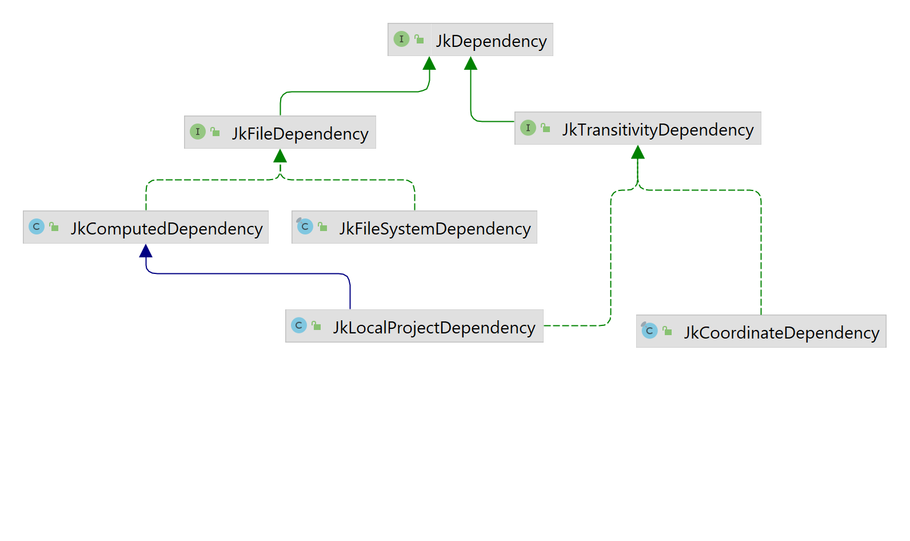

For Jeka, a _dependency_ is something that can be resolved to a set of files by a `JkDependencyResolver`.
Generally a dependency resolves to 1 file (or folder) but it can also be 0 or many.

Compared to mainstream build tools, Jeka offers a simpler and more flexible model to deal with multiple dependency configurations required to build a project.
See [project dependencies](build-library-project-build.md#dependencies)

## Types of Dependency

A dependency is always an instance of `JkDependency`.

Jeka distinguishes between 3 main types of dependency :

* __Arbitrary files__ located on the file system (represented by `JkFileSystemDependency` class). These files are assumed to be present on the file system while the build is running.
* __Files produced by a computation__ (represented by `JkComputedDependency` class). These files may be present on file system, or not. If they are not present, the computation is run in order to produce the missing files. Usually the computation stands for the build of an external project.
* __Coordinate pointing to a remote artifact__ (represented by `JkCoordinateDependency`) hosted in a binary repository (Ivy or Maven for instance) : Jeka can consume and transitively resolve any artifact located in a repository as you would do with Maven, Ivy, or Gradle.

Lastly, Jeka uses _Ivy 2.5.0_ under the hood.
Jeka jar embeds Ivy and executes it in a dedicated classloader to be hidden for client code.



### Coordinate dependency

This type of dependency is represented by a `JkCoordinateDependency` class.
It stands for a Maven/Ivy dependency expressed with coordinates (e.g. _group:module:version).

This is for declaring a dependency on a module hosted in the _Maven_ or _Ivy_ repositories. 
Basically you instantiate a `JkCoordinateDependency` from its group, name, and version.

```Java
JkDependencySet.of()
    .and(JkPopularModule.GUAVA, "18.0")
    .and("com.orientechnologies:orientdb-client:[2.0.8, 2.1.0[")
    .and("mygroup:mymodule:myclassifier:0.2-SNAPSHOT");
```

Many string formats are accepted to specify a module coordinate :

- _group_:_name_
- _group_:_name_:_version_
- _group_:_name_:_classifier_:_version_
- _group_:_name_:_classifier_:_extension_:_version_

_Classifier_ can be either :

- an empty string to specify the default classifier
- a simple string as '_linux_' to specify and retrieve a single classifier variant

!!! note
    By default, dependencies specifying a classifier or an extension are not considered to be transitive. 
    Although, transitivity can be explicitly configured.

_Version_ can be either :

- a static version number, as _1.0.2_
- a snapshot version, as _1.0.2-SNAPSHOT_ 
- a version range, as _[2.0.8, 2.1.0[_

Examples :

- _com.sun.jersey:jersey-server_ : specifies artifact without version
- _com.sun.jersey:jersey-server:1.19.4_ : specifies artifact with version
- _org.lwjgl:lwjgl:natives_linux:3.1.0_ : specifies artifact having *natives_linux* classifier and _3.1.0_ version
- _org.springframework.boot:spring-boot-dependencies::pom:2.5.6_ specifies artifact having _.pom_ extension (to retrieve a BOM)

!!! note

    * A version ending by `-SNAPSHOT` has a special meaning : Jeka will consider it _"changing"_. This means that it won't cache it locally and will download the latest version from repository.
    * As Jeka relies on Ivy under the hood, it accepts dynamic versions as mentioned [here](http://ant.apache.org/ivy/history/latest-milestone/ivyfile/dependency.html).
    * Dependency files are downloaded in _[USER HOME]_/.jeka/cache/repo

Additionally, it's possible to define the transitivity of the dependency using :  

`JkModuleDependency.of("group:name:sources:zip:version").withTransitivity(JkTransitivity.NONE);`

By default, _Jeka_ uses the most relevant transitivity according to the declaration context, so users don't need to specify it 
unless they want a specific one.

See later for more details about _transitivity_.

### File System Dependencies

This type of dependency is represented by the `JkFileSystemDependency` class.

Just mention the path of one or several files. If one of the files does not exist at the time of resolution (when the dependency is actually retrieved), build fails.

```Java
JkDependencySet.of().andFiles("libs/my.jar", "libs/my.testingtool.jar");
``` 

### Computed Dependencies

This type of dependency is represented by the `JkComputedDependency` class.

It is typically used for _multi-modules_ or _multi-techno_ projects.

The principle is that if the specified files are not present, the computation is run in order to generate the missing files.
If some files still missing after the computation has run, the build fails.

This mechanism is quite simple yet powerful as it addresses the following use cases :

* Dependencies on files produced by an artifact producer (`JkArtifactProducer`). A `JkProject` is an artifact producer.
* Dependencies on files produced by external build tools (Ant, Maven, Gradle, SBT, Android SDK, Make, npm ...).
* ... In other words, files produced by any means.

The generic way is to construct this kind of dependency using a `java.lang.Runnable`.

The following snippet constructs a set of dependencies on two external projects : one is built with Maven, the other with
_Jeka_.
```Java
Path mavenProject = Paths.get("../a-maven-project");
JkProcess mavenBuild = JkProcess.of("mvn", "clean", "install")
        .withWorkingDir(mavenProject);
Path mavenProjectJar = mavenProject.resolve("target/maven-project.jar");
JkJavaProject externalProject = 
        JkJavaProject.ofSimple(Paths.get("../a-jeka-project")); 
JkDependencySet deps = JkDependencySet.of()
    .and(JkComputedDependency.of(mavenBuild, mavenProjectJar))
    .and(externalProject);
```

## Dependency Set 

A _dependency set_ (`JkDependencySet`) is an ordered bunch of dependencies used for a given purpose (compilation,
war packaging, testing, ...). It can contain any kind of `JkDependency`. See [here](https://github.com/jerkar/jeka/blob/master/core/src/main/java/dev/jeka/core/api/depmanagement/JkDependencySet.java)

_dependencySet_ also defines :

* A version provider to define which version of a module should be used in case it is not explicitly mentioned. 
* A set of transitive dependency exclusion rules.

It is designed as an immutable object where we can apply set theory operations for adding, removing, or
merging with other dependencies and _dependencySet_.

!!! example

    ```java
    JkDependencySet deps = JkDependencySet.of()
        .and("com.google.guava") 
        .and("org.slf4j:slf4j-simple")
        .and("com.orientechnologies:orientdb-client:2.0.8")
        .andFile("../libs.myjar")
        .withVersionProvider(myVersionProvider);
    ```

!!! note
    * Module versions and scopes can be omitted when declaring dependencies. Versions can be provided by a `JkVersionProvider`.
    * Instances of `JkDependencySet` can be combined in order to construct a large _dependencySet_ from smaller ones.

## Transitivity

For each dependency, mainstream build tools use a single concept (_scope_ or _configuration_) to determine :

1. which part of the build needs the dependency
2. which transitive dependencies to fetch along the dependency
3. with which transitivity the dependency must be published

This confusion leads to dependency management systems that are bloated, difficult to reason with, and not quite flexible.
Gradle comes with a proliferation of 'configurations' to cover most use case combinations,
while Maven narrows 'scopes' to a smaller number, but with limitations and not-so-clear transitivity/publish rules.

In the opposite, Jeka distinguishes clearly the following three purposes :

1. Jeka uses distinct _dependencySet_ instances for each part of the build (compile, runtime, test,...). Each can be
   defined relatively to another using set theory operations.
2. For each dependency, we can decide its transitivity, that is, the transitive dependencies fetched along the dependency.
3. For publishing, we can optionally re-define a specific _dependencySet_, exposing exactly what we want.

Jeka defines by default, three levels of transitivity :

- NONE : Not transitive
- COMPILE : Also fetches transitive dependencies declared with scope 'compile' in the dependency published pom.
- RUNTIME : Also fetches transitive dependencies declared with any scope in the dependency published pom.

!!! notes
    On Maven repositories, published poms can declare only two scopes for transitive dependencies : 'compile' and 'runtime'.

For Ivy repositories, it is possible to declare a specific transitivity that maps to a slave 'configuration'.

The below example shows a JkJavaProject declaration using explicit transitivity.

```Java
JkJavaProject.of().simpleFacade()
    .configureCompileDeps(deps -> deps
            .and("com.google.guava:guava:23.0", JkTransitivity.NONE)
            .and("javax.servlet:javax.servlet-api:4.0.1"))
    .configureRuntimeDeps(deps -> deps
            .and("org.postgresql:postgresql:42.2.19")
            .withTransitivity("com.google.guava:guava", JkTransitivity.RUNTIME)
            .minus("javax.servlet:javax.servlet-api"))
    .configureTestDeps(deps -> deps
            .and(Hint.first(), "org.mockito:mockito-core:2.10.0")
    )
```
It results in :
```
Declared Compile Dependencies : 2 elements.
  com.google.guava:guava:23.0 transitivity:NONE
  javax.servlet:javax.servlet-api:4.0.1
  
Declared Runtime Dependencies : 2 elements.
  com.google.guava:guava:23.0 transitivity:RUNTIME
  org.postgresql:postgresql:42.2.19
  
Declared Test Dependencies : 4 elements.
  org.mockito:mockito-core:2.10.0
  com.google.guava:guava:23.0 transitivity:RUNTIME
  org.postgresql:postgresql:42.2.19
  javax.servlet:javax.servlet-api:4.0.1
```
Dependencies without any transitivity specified will take default transitivity for
their purpose, namely COMPILE for compile dependencies, and RUNTIME for runtime and test dependencies.

The API allows you to redefine the transitivity declared in a upper dependency set.

Note that transitivity can only apply to `JkModuleDependency` (like <i>com.google.guava:guava:23.0</i>)
and `JkLocalProjectDependency`.

## Resolve Dependencies

The `JkDependencyResolver` class is responsible JkDependencyResolver.of(JkRepo.ofMavenCentral());to resolve dependencies by returning `JkResolveResult` from a
`JkdependencySet`.

```java
JkDependencySet deps = JkDependencySet.of()
                            .and("org.apache.httpcomponents:httpclient:4.5.3")
                            .andFile("libs/my.jar");

// Here, module dependencies are fetched from Maven central repo
JkDependencyResolver resolver = 
        JkDependencyResolver.of(JkRepo.ofMavenCentral());  
JkResolveResult result = resolver().resolve(deps);
```

From the result you can :

* Navigate in the resolved dependency tree as :

```java
JkDependencyNode slfjApiNodeDep = result.getDependencyTree()
        .getFirst(JkModuleId.of("org.slf4j:slf4j-api"));
System.out.println(slfjApiNode.getModuleInfo().getResolvedVersion());
```

* Get the direct list of artifact files

```java
JkPathSequence sequence = result.getFiles();  
sequence.forEach(System.out::println); // print each files part of the result
```

## Publication

Jeka is able to publish on both the Maven and Ivy repositories. This includes repositories such as [Sonatype Nexus](http://www.sonatype.org/nexus/).

Maven and Ivy have different publication models, so Jeka proposes specific APIs according to whether you want to publish on a Maven or Ivy repository.

### Publish on a Maven repository

Jeka proposes a complete API to pubish on Maven repository. POM files will be generated by Jeka according to
provided elements.

Find an example [here](https://github.com/jeka-dev/jeka/blob/master/samples/dev.jeka.samples.basic/jeka/def/dev/jeka/core/samples/AntStyleJkBean.java)


Notice that Jeka allows you to :

- Publish more than one artifact.
- Produce & publish checksum files for each published artifact.
- Mention using unique snapshots ([What is it ?](http://stackoverflow.com/questions/1243574/how-to-stop-maven-artifactory-from-keeping-snapshots-with-timestamps)).
- Feed generated pom with data necessary to publish on [central repository](https://maven.apache.org/guides/mini/guide-central-repository-upload.html).
- Sign published artifacts with PGP
- Publish to multiple repositories by creating the publisher using a `JkRepoSet` instead of a `JkRepo`.

To sign with PGP, there is no need to have PGP installed on Jeka machine. Jeka uses <a href="https://www.bouncycastle.org/">Bouncy Castle</a> internally to sign artifacts.

### Publish to a Ivy repository

Publishing on Ivy repo is pretty similar to publishing on Maven, though there are options specific to Ivy.

See also [here](https://github.com/jeka-dev/jeka/blob/master/samples/dev.jeka.samples.basic/jeka/def/dev/jeka/core/samples/AntStyleJkBean.java)


## Common Classes

* `JkRepo` and `JkRepoSet` represent both download and upload repositories. 

* `JkRepoFromProperties`provides configured repositories according to global or project scopes _properties_.

* `JkDependencySet` represents a set of dependencies.

* `JkDependencyResolver` resolves dependencies to classpaths and resolution results that allow resolution exploration.

* `JkModuleFileProxy` provides an smart way to get a file from its coordinates.
