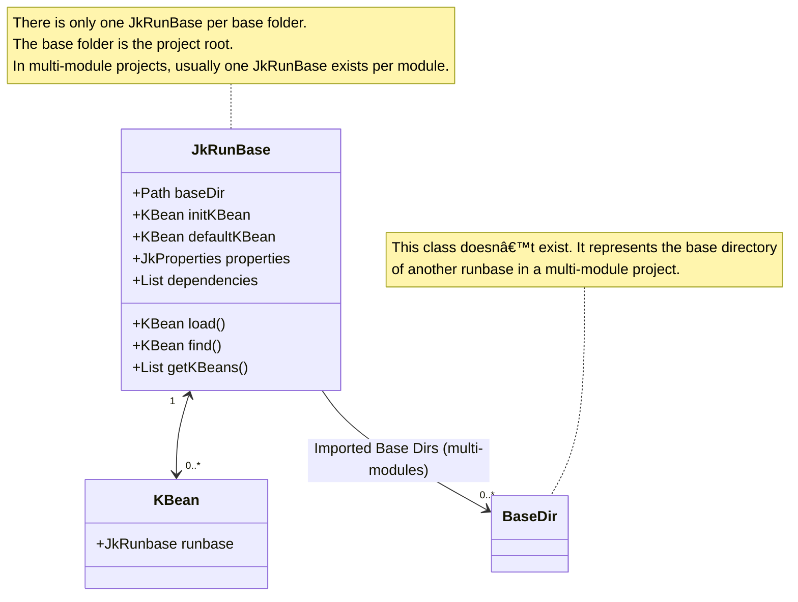

_KBean_ is the central concept of the execution engine. _KBeans_ are classes with declared executable methods.  
There is only one _KBean_ instance per _KBean_ class in any given Jeka base directory.

_KBean_ classes share the following characteristics:

* They extend the `KBean` class.
* They may declare `public void` methods without arguments. All these methods can be invoked from the command line.
* They may declare `public` fields _(also known as KBean properties)_. These field values can be injected from the command line.  
  Additionally, they can have non-public fields annotated with `@JkDoc`.
* They must provide a no-argument constructor.
* They may override the `init()` method.
* They must be instantiated by the execution engine and not by user code.

## Simple Example

The following KBeans expose the `hello` and `bye` methods. The rendering can be configured 
through `nema` and `uppercase` attributes.

```Java
import dev.jeka.core.tool.JkDoc;

@JkDoc("Displays greeting messages")
public class Greeting extends KBean {

    public String name = "Bob";

    @JkDoc("If true, the message is shown in upper case.")
    public boolean uppercase;

    @JkDoc("Prints a hello message.")
    public void hello() {
        System.out.println(formatMessage("Hello " + name + "!"));
    }
    
    public void bye() {
        System.out.println(formatMessage("Goodbye " + name + "!"));
    }

    private String formatMessage(String message) {
        return uppercase ? message.toUpperCase() : message;
    }
}
```
To execute a method from the command line, run the following example:
```bash
jeka hello name=Alice uppercase=true
```
To show help for this KBean, run:
```bash
jeka greeting: --doc
```
This will display:
```text
Displays greeting messages.

Fields
      name=<String>   No description.
                        Default: Bob
      uppercase       If true, the message is shown in upper case.
                        Default: false
Methods
  bye    No Description.
  hello  Prints a hello message.
```

## Location

KBeans can exists as source code in the local project *jeka-src* folder, at root or any package,  or 
as class in the Jeka classpath.

**Multiple KBeans in jeka-src**

Many KBeans may coexist in a single *jeka-src* dir. In this case, use KBean names to precise on 
which bean to invoke, as:

```bash
jeka greeting: hello bye other: foo
```
In the above example, three methods coming from 2 distinct KBean are invoked.

**Classpath KBeans**

Jeka bundles a collection of KBeans for building projects, creating Docker images, performing Git operations, and more.

For example, running:
```bash
jeka project: compile
```
will compile the source code located in the *src/main/java* directory, using dependencies specified in the *dependencies.txt* file.

To display the documentation for the `project` KBean, run:
```bash
jeka project: --doc
```

To list all available KBeans in the classpath, execute:
```bash
jeka --doc
```

KBeans can be added to the classpath like any third-party dependency.  
This can be done by setting the `jeka.inject.classpath` property in the *jeka.properties* file as follows:
```properties
jeka.inject.classpath=dev.jeka:springboot-plugin   dev.jeka:openapi-plugin:0.11.8-1
```

KBeans can also be included directly in the source code using the `@JkDep` annotation:
```java
import dev.jeka.core.tool.JkDep;

@JkDep("dev.jeka:springboot-plugin")
@JkDep("dev.jeka:openapi-plugin:0.11.8-1")
class Build extends KBean {
...
```

Additionally, KBeans can be dynamically added from the command line like this:
```bash
jeka --classpath=dev.jeka:openapi-plugin:0.11.8-1 openapi:--doc
```

Jeka discovers KBeans automatically by scanning the classpath.

## KBean Methods

A _KBean method_ is a specific method defined in a KBean class, designed to be executable from the command line interface. For successful recognition as a _command_, the method must adhere to the following criteria:

* It must be designated as `public`.
* It must be an instance method, not static or abstract.
* It must not require any arguments upon invocation.
* It must not return any value, as indicated by a `void` return type.

## KBean Attributes

A _KBean attribute_ is a `public` instance field of a KBean class. Its value can be injected from the command line or from a property file.  
Additionally, it can be a non-public field annotated with `@JkDoc`.

Attributes can be annotated with `@JkInjectProperty("my.prop.name")` to inject the value of a _property_ into the field.

We can also inject value using *jeka.properties

For more details on field accepted types, see the `dev.jeka.core.tool.FieldInjector#parse` [method](https://github.com/jeka-dev/jeka/blob/master/dev.jeka.core/src/main/java/dev/jeka/core/tool/FieldInjector.java).

_KBean attributes_ can also represent nested composite objects. See the example in the `ProjectKBean#pack` [field](https://github.com/jeka-dev/jeka/blob/master/dev.jeka.core/src/main/java/dev/jeka/core/tool/builtins/project/ProjectKBean.java).

## Naming KBeans

To be referenced conveniently, _KBeans_ can be identified by specific names. For any given _KBean_ class, the accepted names are:

1. Fully qualified class name.
2. Uncapitalized simple class name (e.g., `myBuild` matches `org.example.MyBuild`).
3. Uncapitalized simple class name without the `KBean` suffix (e.g., `project` matches `dev.jeka.core.tool.builtin.project.ProjectKBean`).

!!! tip
    Execute `jeka` at the root of a project to display the _KBeans_ available on the _Jeka classpath_.

## Document KBeans

_KBean_ classes, methods, and attributes can be annotated with the `@JkDoc` annotation to provide self-documentation.  
The text provided in these annotations is displayed when running the command:  
`jeka <kbeanName>: --doc`

## Invoke KBeans

### From the Command Line

_KBean_ methods can be executed directly from the command line using the syntax:

`jeka <kbeanName>: [methodName...] [attributeName=xxx...]`

**Example:** `jeka project: info pack tests.fork=false pack.jarType=FAT jacoco: sonarqube: run`

You can call multiple methods and set multiple attributes in a single command.
    

### From IntelliJ Jeka Plugin

The [IntelliJ Jeka Plugin](https://plugins.jetbrains.com/plugin/24505-jeka) enables invoking KBean methods directly from the IDE, 
either from the code editor or the project explorer tool window.

### From a Plain IDE Setup

_KBean_ methods can also be launched or debugged in an IDE by invoking the `dev.jeka.core.tool.Main` method and passing the corresponding command-line arguments.

**Example:**  
Invoking the `dev.jeka.core.tool.Main` method with arguments `project:` and `compile` will instantiate the `ProjectKBean` class and invoke its `compile` method.

!!! warning
    Ensure that the _main_ method is launched with the **module directory** set as the **working directory**.  
    In IntelliJ, the default working directory is the _project directory_, which may cause issues.

    To update IntelliJ defaults:  
    - Navigate to **Run | Edit Configurations... | Application | Working Directory**  
    - Set the value to `$MODULE_DIR$`.


## Default KBean
The _[kbeanName]_ prefix is optional and defaults to:

- The KBean specified by the `jeka.kbean.default` property (if this property is set).
- If the property is not set, it defaults to the first KBean found in the _jeka-src_ directory, sorted alphabetically by fully qualified class name.

### Example
The following command:
```
jeka doSomething aProperty=xxxx
```  
executes the `doSomething` method of the default KBean.

To explicitly reference the default KBean and avoid ambiguity, use `:` as the prefix.

### Examples
- `jeka : --doc` displays the documentation of the default KBean.
- `jeka --doc` displays the overall documentation.


## KBean Collaboration

_KBeans_ can interact with each another by using the `KBean#load(MyBean.class)` method.

Alternatively, we can use the `KBean#find(MyKBean.class)` method, which returns an `Optional<KBean>` containing the instance only if it already exists in the context.

When a _KBean_ is declared as a field, the IDE detects it and show it explicitly in the KBean tree.

```Java   title="A Kbean modifying and delagating to `ProjectKBean`"
import dev.jeka.core.api.project.JkProject;

@JkDoc("A simple example to illustrate KBean concept.")
public class Build extends KBean {

    final ProjectKBean projectKBean = load(ProjectKBean.class);  // Instantiate KBean or return singleton instance.

    @Override  
    protected void init() {  // When init() is invoked, projectKBean field instances has already been injected.
        projectKBean.project.flatFacade.compileDependencies
                .add("com.google.guava:guava:30.0-jre")
                .add("com.sun.jersey:jersey-server:1.19.4");
        projectKBean.project.flatFacade.testDependencies
                .add("org.junit.jupiter:junit-jupiter:5.8.1");
    }

    @JkDoc("Clean, compile, test, create jar files, and publish them.")
    public void packPublish() {
        projectKBean.pack();
        projectKBean.publishLocal();
    }
    
}
```
In this example, `Build` KBean configures the undelying `JkProject` of the `ProjectKBean` isnstance, by defining dependencies.
It provides a `packPublish` method that delegate to `ProjectKBean`.

## Lifecycle

This diagram shows how KBean instances are created or retrieved.





## Multi-Project setup

In multi-project scenarios, it is common for a _KBean_ in one project to access a _KBean_ instance from another project. This can be achieved in a statically typed manner:

1. In the **master** _KBean_, declare a field of type `KBean` (e.g., `KBean importedBuild;`). This field does not need to be public.
2. Annotate the field, by specifying the relative path of the imported project (e.g., `@JkInjectRunbase("../anotherModule")`).
3. Run the command `jeka intellij: iml` or `jeka eclipse: files` to refresh project metadata.
4. Change the declared field type from `KBean` to the concrete type of the imported _KBean_.
5. The master _KBean_ can now access the imported _KBean_ in a type-safe manner.
6. For an example, see [this implementation](https://github.com/jeka-dev/jeka/blob/master/dev.jeka.master/jeka-src/MasterBuild.java).

!!! tip
    Ensure that the imported _KBean_ uses `KBean#getBaseDir` for handling file paths. This practice ensures safe execution from any working directory.

