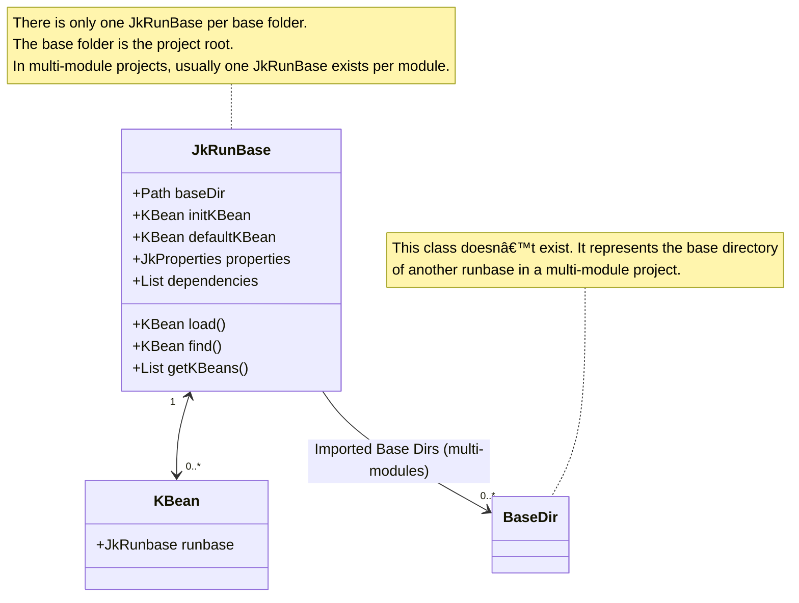

_KBean_ is the central concept of the execution engine. _KBeans_ are classes with declared executable methods.  
There is only one _KBean_ instance per _KBean_ class in any given Jeka base directory.

_KBean_ classes share the following characteristics:

* They extend the `KBean` class.
* They may declare `public void` methods without arguments. All these methods can be invoked from the command line.
* They may declare `public` fields _(also known as KBean properties)_. These field values can be injected from the command line.  
  Additionally, they can have non-public fields annotated with `@JkDoc`.
* They must provide a no-argument constructor.
* They may override the `init()` method.
* They must be instantiated by the execution engine and not by user code.

## Simple Example

The following KBeans expose the `hello` and `bye` methods. The rendering can be configured 
through `nema` and `uppercase` attributes.

```Java
@JkDoc("Displays greeting messages")
public class Greeting extends KBean {

    public String name = "Bob";

    @JkDoc("If true, the message is shown in upper case.")
    public boolean uppercase;

    @JkDoc("Prints a hello message.")
    public void hello() {
        System.out.println(formatMessage("Hello " + name + "!"));
    }
    
    public void bye() {
        System.out.println(formatMessage("Goodbye " + name + "!"));
    }

    private String formatMessage(String message) {
        return uppercase ? message.toUpperCase() : message;
    }
}
```
To execute a method from the command line, run the following example:
```bash
jeka hello name=Alice uppercase=true
```
To show help for this KBean, run:
```bash
jeka greeting: --doc
```
This will display:
```text
Displays greeting messages.

Fields
      name=<String>   No description.
                        Default: Bob
      uppercase       If true, the message is shown in upper case.
                        Default: false
Methods
  bye    No Description.
  hello  Prints a hello message.
```

## Location

KBeans can exists as source code in the local project *jeka-src* folder, at root or any package,  or 
as class in the Jeka classpath.

**Multiple KBeans in jeka-src**

Many KBeans may coexist in a single *jeka-src* dir. In this case, use KBean names to precise on 
which bean to invoke, as:

```bash
jeka greeting: hello bye other: foo
```
In the above example, three methods coming from 2 distinct KBean are invoked.

**Classpath KBeans**

Jeka bundles a collection of KBeans for building projects, creating Docker images, performing Git operations, and more.

For example, running:
```bash
jeka project: compile
```
will compile the source code located in the *src/main/java* directory, using dependencies specified in the *dependencies.txt* file.

To display the documentation for the `project` KBean, run:
```bash
jeka project: --doc
```

To list all available KBeans in the classpath, execute:
```bash
jeka --doc
```

KBeans can be added to the classpath like any third-party dependency.  
This can be done by setting the `jeka.inject.classpath` property in the *jeka.properties* file as follows:
```properties
jeka.classpath=dev.jeka:springboot-plugin   dev.jeka:openapi-plugin:0.11.8-1
```

KBeans can also be included directly in the source code using the `@JkDep` annotation:
```java
import dev.jeka.core.tool.JkDep;

@JkDep("dev.jeka:springboot-plugin")
@JkDep("dev.jeka:openapi-plugin:0.11.8-1")
class Custom extends KBean {
...
```

Additionally, KBeans can be dynamically added from the command line like this:
```bash
jeka --classpath=dev.jeka:openapi-plugin:0.11.8-1 openapi:--doc
```

Jeka discovers KBeans automatically by scanning the classpath.

## KBean Methods

A _KBean method_ is a specific method defined in a KBean class, designed to be executable from the command line interface. For successful recognition as a _command_, the method must adhere to the following criteria:

* It must be designated as `public`.
* It must be an instance method, not static or abstract.
* It must not require any arguments upon invocation.
* It must not return any value, as indicated by a `void` return type.

## KBean Fields

A _KBean field_ is a `public` instance field of a KBean class. Its value can be injected from the command line or from a property file.  
Additionally, it can be a non-public field annotated with `@JkDoc`.

Fields can be annotated with `@JkInjectProperty("my.prop.name")` to inject the value of a _property_ into the field.

We can also inject value using *jeka.properties

For more details on field accepted types, see the `dev.jeka.core.tool.FieldInjector#parse` [method](https://github.com/jeka-dev/jeka/blob/master/dev.jeka.core/src/main/java/dev/jeka/core/tool/FieldInjector.java).

_KBean fields_ can also represent nested composite objects. See the example in the `ProjectKBean#pack` [field](https://github.com/jeka-dev/jeka/blob/master/core/src/main/java/dev/jeka/core/tool/builtins/project/ProjectKBean.java).

## Naming KBeans

To be referenced conveniently, _KBeans_ can be identified by specific names. For any given _KBean_ class, the accepted names are:

1. Fully qualified class name.
2. Uncapitalized simple class name (e.g., `myBuild` matches `org.example.MyBuild`).
3. Uncapitalized simple class name without the `KBean` suffix (e.g., `project` matches `dev.jeka.core.tool.builtin.project.ProjectKBean`).

!!! tip
    Execute `jeka` at the root of a project to display the _KBeans_ available on the _Jeka classpath_.

## Document KBeans

_KBean_ classes, methods, and attributes can include the `@JkDoc` annotation to provide self-documentation.  
The text from these annotations is displayed when running the command:
```shell
jeka <kbeanName>: --doc
```
To display documentation for the default KBean, simply run:
```shell
jeka --doc
```

Use the `@JkDocUrl` annotation to indicate that a KBean has online documentation.
This URL will be displayed in the output of the `--doc` command.

To document your KBean, you can use the following command:
```shell
jeka <kbeanName>: --doc-md
```
This command generates a markdown-formatted document of the specified KBean.
You can copy and paste the output directly into your online documentation.

## Invoke KBeans

### From the Command Line

_KBean_ methods can be executed directly from the command line using the syntax:

```shell
jeka <kbeanName>: [methodName...] [attributeName=xxx...]
```

**Example:** 
```shell
jeka project: info pack tests.fork=false pack.jarType=FAT sonarqube: run
```

You can call multiple methods and set multiple fields in a single command.
    

### From IntelliJ Jeka Plugin

The [IntelliJ Jeka Plugin](https://plugins.jetbrains.com/plugin/24505-jeka) enables invoking KBean methods directly from the IDE, 
either from the code editor or the project explorer tool window.

### From a Plain IDE Setup

_KBean_ methods can also be launched or debugged in an IDE by invoking the `dev.jeka.core.tool.Main` method and passing the corresponding command-line arguments.

**Example:**  
Invoking the `dev.jeka.core.tool.Main` method with arguments `project:` and `compile` will instantiate the `ProjectKBean` class and invoke its `compile` method.

!!! warning
    Ensure that the _main_ method is launched with the **module directory** set as the **working directory**.  
    In IntelliJ, the default working directory is the _project directory_, which may cause issues.

    To update IntelliJ defaults:  
    - Navigate to **Run | Edit Configurations... | Application | Working Directory**  
    - Set the value to `$MODULE_DIR$`.


## Default KBean

When invoking Kbean methods or fields, we generally specify to which KBean this applies:

Examples:
```shell
jeka project: pack
jeka myBean: foo bar=1
```

If the target KBean is the *default KBean*, then this we don't need to mention the KBean name.

By default, the *default KBean* is the first KBean found in *jeka-src* dir.  For instance, if you have a single KBean 
`MyBean` in *jeka-src*, then you can invoke directly the methods and fields as following:
```shell
jeka foo bar=1
```
If you need to invoke methods of other KBean, in between, you can use the `:` symbol as:
```shell
jeka project: pack : foo bar=1
```
The above example invokes the `ProjectKBean#pack` method, then the  `MyBean#foo` method.

You can select a specific default KBean, by setting the following property in *jeka-src* or as command-line argument:
```properties
jeka.kbean.default=project
```

You can also mention the default KBean using `--kbean=` option.

The default KBean always participate in the runbase initialisation.

This is quite frequent for project builds to use such setting as it shortens command line and prone usage of 
`ProjectKBean` standard methods.

## KBean Initialization

During startup, JeKa initializes these KBeans:

- The default KBean
- KBeans specified with `@myKbean=on` in *jeka.properties*

After identifying these initial KBeans, JeKa performs a discovery phase to find additional KBeans that need initialization:

- KBeans referenced as parameters in methods annotated with `@JkPostInit(required = true)`
- KBeans returned by static methods annotated with `@JkRequire`

This discovery mechanism allows dynamic addition of KBeans to the initialization list.

**Example:**

If you have a `Custom` KBean located in the *jeka-src* directory, its class will be inspected under two conditions:

1. It is set as the default KBean
2. It is enabled with `@custom=on` in the *jeka.properties* file

Then it will be inspected to discover other KBeans to initialize.

```java
import dev.jeka.core.tool.JkPostInit;
import dev.jeka.core.tool.builtins.tooling.maven.MavenKBean;

class Custom extends KBean {

    @JkRequire
    private static Class<? extends KBean> require(JkRunbase runbase) {
        return runbase.getBuildableClass();
    }

    @JkPostInit(required = true)
    private void postInit(MavenKBean mavenKBean) {
        ...
    }
}
```

In this example, the `MavenKBean` will be included in the initialized KBeans.

The `require(JkRunbase)` method will be invoked to know which KBean should be initialized too (either `ProjectKBean` nor `BaseKBean`.)


## Invoke KBean from another KBean

### Using @JkInject

```Java 
import dev.jeka.core.tool.builtins.project.ProjectKBean;
import dev.jeka.core.tool.builtins.tooling.maven.MavenKBean;
import dev.jeka.core.tool.JkInject;

@JkDoc("A simple example to illustrate KBean concept.")
class Build extends KBean {

    @JkInject
    private ProjectKBean projectKBean;
    
    @JkInject
    private MavenKBean mavenKBean;

    @JkDoc("Clean, compile, test, create jar files, and publish them.")
    public void packPublish() {
        projectKBean.clean();
        projectKBean.pack();
        mavenKBean.publishLocal();
    }

}
```
Both `ProjectKBean` and `MavenKBean` are created and injected into the `Build` KBean during initialization.

### Using #load and #find methods

As we saw earlier, you can dynamically retrieve a `KBean` using the `KBean#load(Class)` method.  
This method forces the initialization of the `KBean` if it is not already present.  
It is useful when you need a specific `KBean` only within certain methods.

```java
@JkDoc("Compiles application to native executable")
public void createNativeExec() {
    load(NativeKBean.class).compile();
}

```

On the other hand, the `KBean#find(Class)` method returns an `Optional<? extends KBean>`,  
which is empty if the specified `KBean` is not initialized.  
This is helpful for performing conditional tasks based on the presence of a `KBean`.

```java
import dev.jeka.core.tool.builtins.tooling.docker.DockerKBean;

public void cleanup() {
    find(DockerKBean.class).ifPresent(dockerKBean -> {
        // Do something
    });
}
```

## Configure a Kbean from another KBean.

Whether you want to create a JeKa plugin or simply configure a build, the approach is the same: 
create a `KBean` and configure an existing one.

For example, to configure a build, you can create a `Build` class as follows:

```java
class Build extends KBean {

    public boolean skipIT;

    @JkPreInit
    private static void preInit(ProjectKBean projectKBean) {
        projectKBean.tests.progress = JkTestProcessor.JkProgressStyle.PLAIN;
    }

    @JkPostInit(required = true)
    private void postInit(ProjectKBean projectKBean) {
        JkProject project = projectKBean.project;
        project.flatFacade.dependencies.compile
                .add("com.google.guava:guava:33.3.1-jre")
                .add("org.openjfx:javafx-base:21");
        project.flatFacade.dependencies.test
                .add("org.junit.jupiter:junit-jupiter:5.8.1");
        project.flatFacade
                .addTestExcludeFilterSuffixedBy("IT", skipIT);
    }

    @JkPostInit
    private void postInit(MavenKBean mavenKBean) {

        // Customize the published pom dependencies
        mavenKBean.getMavenPublication().customizeDependencies(deps -> deps
                .withTransitivity("com.google.guava:guava", JkTransitivity.RUNTIME)
                .minus("org.openjfx:javafx")
        );
    }

}
```
This KBean defines a `Build` class that customizes the `project` and `maven` KBeans. 

### Pre-initialize KBeans

The `preInit` methods are invoked before the KBean is instantiated; therefore, they must be declared as `static`.  
These methods are applied to the target KBean immediately after it is instantiated but before it is initialized.  
This means they are executed prior to the injection of properties or command-line values.

The sole purpose of `preInit` methods is to provide default values, which can later be overridden by properties or command-line arguments.  
They should not perform further configuration, as the target KBean has not yet been fully initialized when these methods are invoked.

### Post-initialize KBeans

The `postInit` methods are invoked only if their respective `KBean` is fully initialized. 
This occurs after its properties and command-line values have been injected, and its `init()` method has been executed.

The `required = true` attribute, means that the KBean project must be instantiated by JeKa, if not already setup.

For example, when executing `jeka project: pack`, the `ProjectKBean` will be initialized with the settings provided by 
command-line arguments and `@project...=` properties defined in the *jeka.properties* file. 
The instance will then be passed to the `postInit` method before invoking the `pack` method.

When executing `jeka maven: publish`, the `project` KBean will be implicitly loaded and configured, 
followed by the same process for the `maven` KBean, before invoking the `publish` method.

## Lifecycle

Before Kbean methods are executed, Kbeans are configured as described in the detailed sequence:


### Post initialisation.

One all the KBean has been initialized, bean already initialized or extra one can be invoked from the KBean methods.





## Multi-Project setup

In multi-project scenarios, it is common for a _KBean_ in one project to access a _KBean_ instance from another project. This can be achieved in a statically typed manner:

1. In the **master** _KBean_, declare a field of type `KBean` (e.g., `KBean importedBuild;`). This field does not need to be public.
2. Annotate the field, by specifying the relative path of the imported project (e.g., `@JkInjectRunbase("../anotherModule")`).
3. Run the command `jeka intellij: iml` or `jeka eclipse: files` to refresh project metadata.
4. Change the declared field type from `KBean` to the concrete type of the imported _KBean_.
5. The master _KBean_ can now access the imported _KBean_ in a type-safe manner.
6. For an example, see [this implementation](https://github.com/jeka-dev/jeka/blob/master/dev.jeka.master/jeka-src/MasterBuild.java).

!!! tip
    Ensure that the imported _KBean_ uses `KBean#getBaseDir` for handling file paths. This practice ensures safe execution from any working directory.

For multi-module projects, use `JkInject` to access sub-module KBeans.

```java
import dev.jeka.core.tool.builtins.project.ProjectKBean;
import dev.jeka.core.tool.builtins.tooling.maven.MavenKBean;
import dev.jeka.core.tool.JkInject;

import java.util.List;

@JkDoc("A simple example to illustrate KBean concept.")
public class MasterBuild extends KBean {

    @JkInject("./foo")
    ProjectKBean fooProject;

    @JkInject("./bar")
    ProjectKBean barProject;

    @JkDoc("For all sub-modules: clean, compile, test, create jar files, and publish them.")
    public void buildAll() {
        List.of(fooProject, barProject).forEach(projectKbean -> {
            projectKbean.clean();
            projectKbean.pack();
            MavenKBean mavenKBean = projectKbean.load(MavenKBean.class);
            mavenKBean.publishLocal();
        });
    }
}
```
In this example, JeKa initializes KBeans from the sub-modules *./foo* and *./bar*, then injects them into the `MasterBuild` KBean.

We can create or load a KBean on the fly using the `KBean#load` method.
This means we only need to declare one KBean per sub-module.

Another option is to inject `JkRunbase` and make all calls through it:

```java
import dev.jeka.core.tool.JkRunbase;
import dev.jeka.core.tool.builtins.project.ProjectKBean;
import dev.jeka.core.tool.builtins.tooling.maven.MavenKBean;
import dev.jeka.core.tool.JkInject;

import java.util.List;

@JkDoc("A simple example to illustrate KBean concept.")
public class MasterBuild extends KBean {

    @JkInject("./foo")
    JkRunbase foo;

    @JkInject("./bar")
    JkRunbase bar;

    @JkDoc("For all sun-modules: clean, compile, test, create jar files, and publish them.")
    public void buildAll() {
        List.of(foo, bar).forEach(runbase -> {
            ProjectKBean projectKBean = runbase.load(ProjectKBean.class);
            projectKbean.clean();
            projectKbean.pack();
            MavenKBean mavenKBean = runbase.load(MavenKBean.class);
            mavenKBean.publishLocal();
        });
    }
}
```

For larger sub-project structures, use `KBean#getImportedKBeans()` to list all sub-modules, either recursively or not.

```java
@JkDoc("For all sub-modules: compile, test, create jar files, and publish them.")
public void buildAll() {
    this.getImportedKBeans().get(ProjectKBean.class, true).forEach(ProjectKBean::pack);
    this.getImportedKBeans().get(MavenKBean.class, true).forEach(MavenKBean::publish);
}
```
