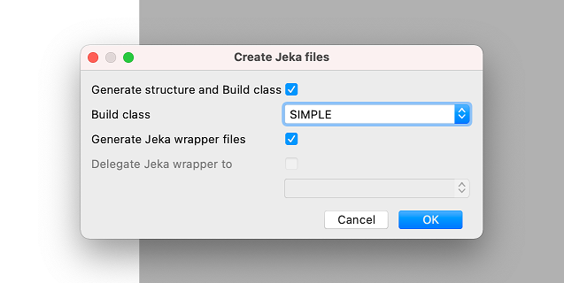
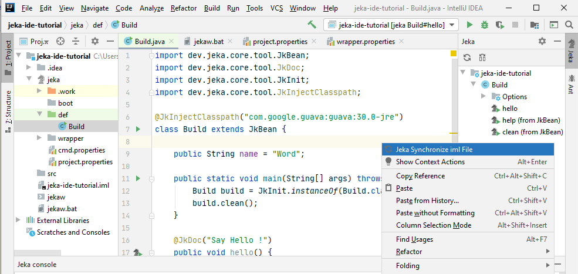
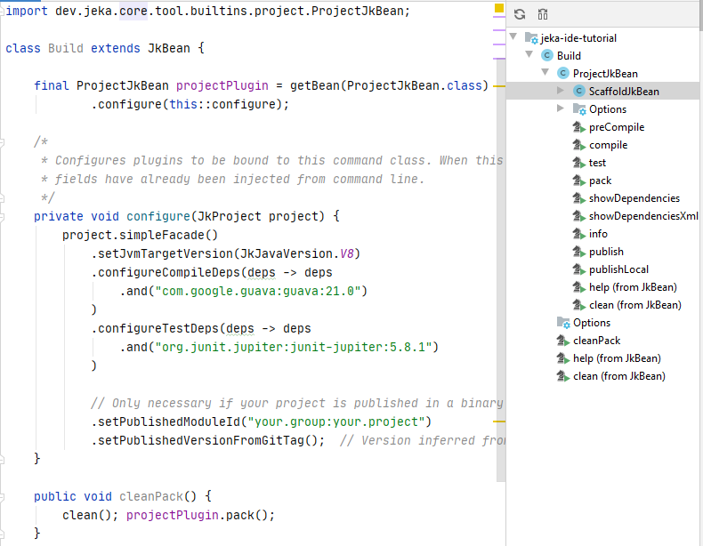
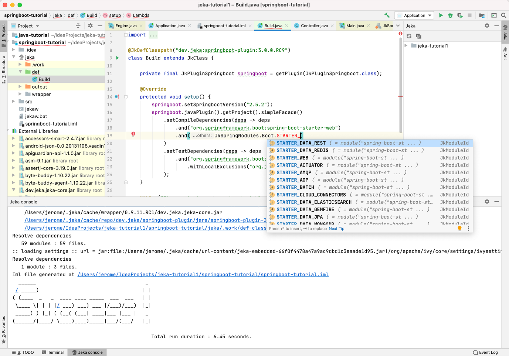

# Getting started with Jeka

!!! warning
    This plugin currently works with Jeka version 0.9.15.RELEASE.

    Next version of Jeka (0.9.20), which is documented here, is not yet working with the IntelliJ Plugin. 

## Install Intellij Plugin 

* Install plugin directly from [here](https://plugins.jetbrains.com/plugin/13489-jeka)
or search _jeka_ in Intellij Marketplace.

As this plugin embbeds its own version of _Jeka_, that's all you need to install on your machine.

## Hello World ! 

The below example showcases how to write tasks executable both from IDE and command line. 

* Create a basic Java module in Intellij : _New_ > _Module ..._ > _Java_ > _Next_ > _Finish_

* Right-click on the module, then _Jeka_ > _Generate Jeka files and folders..._

  
* Dialog box will be open with default setting

* Select *SIMPLE* and click _OK_

_You get the following..._

The _Jeka_ folder structure will be generated with an empty _Jeka_ class.

On the right side of the IDE, nodes can be expanded to navigate on Jeka commands. These commands either come from the `Commands` class or plugins present in classpath.

* Click _Commands_ > _help_ to trigger the `help` method coming from `Commands` class.
This will display a contextual help from a list of all available commands and options.
  
  
* Open a terminal and execute `./jekaw help`. This will execute the same but from the command line. For this, 
  `jekaw` compiles your `Commands` classes behind the scene and execute a Java program which invokes the method.

Now, you can add your own commands (like `hello` in above example) just by declaring a public no-arg method returning `void`.
Your new method should appear instantaneously in Jeka window tool on the right.

* For adding properties, just declare a public field as shown below.

* Execute or debug the method by clicking on editor gutter or Jeka tool window. 

* Execute `./jekaw hello -name=Joe` in terminal for invoking method while injecting property value.

You can write as many method as you want, of any complexity. Also, your project can contain several KBeans.
The first KBean class found (by fully qualified name order) is the default KBean.

To run `doSomething` method on a specific kbean class named `here.is.MyOtherBean`, execute `./jekaw -kb=MyOtherBean doSomething` 
or `./jekaw myOtherBean#doSomething`

!!! tip
    Execute `./jekaw -help` at the root of the project to knows more about command-line.

[Learn more about KBeans](/reference-guide/execution-engine-concepts/#kbeans)

## Import 3rd Party libraries 

Your classes can also use any third party libraries available on your file system or in a bynary repository.

Let's add *guava* to our `Build` class : just add the `@JkInjectClasspath` annotation and refresh ide module to 
make it available on IDE classpath.

 
Now you can use guava in your _Build_ class.

## Build a Java Project

It's possible to use your favorite build tool (Maven, Gradle, ...) beside Jeka in your project and let Jeka delegate builds.

It's also possible to build projects(compile, tests, jars, publish) using native Jeka capabilities.

1. Create a basic Java module in Intellij 

2. Right-click on the module then _Jeka_ > _Generate Jeka files and folders..._

This opens a dialog box. Select *PROJECT* and press OK.

!!! notes
    The box *'delegate Jeka Wrapper to'* means that the module *tutorial-2* will reuse the same Jeka wrapper 
    (and therefore the same Jeka version) than *tutorial-1*. That way, we can force all Java modules from a same Intellij 
    project, to use the same Jeka Version, defined in one place.

This generates a Build template class in `jeka/def` along source folders.

You can launch directly any method declared on this class or navigate in Jeka right tool to discover methods available 
on this class or available plugin.

After modifying your dependencies, do not forget to refresh module in order intellij take it in account.
Invoke `cleanPack` to build project from scratch.

Now your project is ready to code. You will find many project examples [here](https://github.com/jerkar/working-examples)

[Learn more about Java project builds](/reference-guide/build-library-project-build)

[Learn more about dependency management](/reference-guide/build-library-dependency-management)
 

## Build a Springboot Project 

Jeka offers a plugin mechanism to let 3rd parties extend the product. An external plugin for Springboot 
exists and is tightly integrated in Intellij Plugin.

* Create a new module in IntelliJ

* Right-click on a module then _Jeka_ > _Generate Jeka files and folders..._

* This opens a dialog box. Select *Springboot* and press OK.

This generates a sample project along its build class based on the last *Springboot* version.

You can invoke regular commands as *clean*,*pack*, ... The plugin offers additional commands 
to run the application from the built jar.

  

The plugin proposes popular _Spring_ modules as constant to help pickup dependencies.

You can also switch Springboot version easily by changing `#springbootVersion` argument.

!!! warning
    Do not forget to trigger 'Jeka Synchronize Module' available in context menues, each time you modify dependencies or change springboot version.
    It let Intellij synchronize its iml file with dependencies declared in Jeka.

