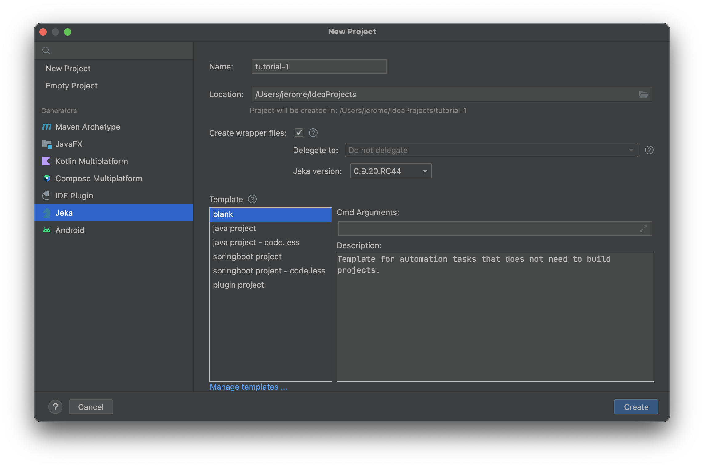
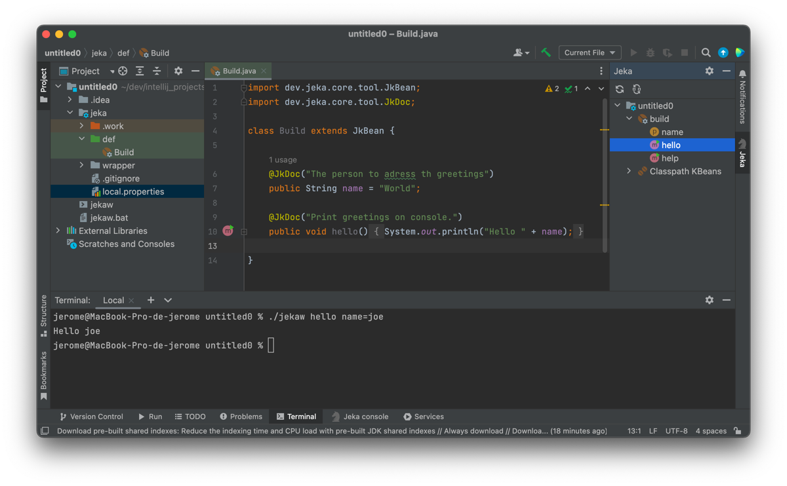

# Getting started with Jeka

## Install Intellij Plugin 

* Install plugin directly from [here](https://plugins.jetbrains.com/plugin/13489-jeka)
or search _jeka_ in Intellij Marketplace.

As this plugin embeds its own version of _Jeka_, that's all we need to install on our machine.

## Hello World ! 

The below example showcases how to write tasks executable both from IDE and the  command line. 

* Create a new Jeka project in Intellij : _New_ > _Project ..._ > _Jeka_ 

Leave default (we might change the name) and press _Create_.

!!! Note
    A Jeka structure (folders and files) can be created in an existing project of any type.
    On IntelliJ *project* window-tool : _Select project_ > Click Left > Jeka ... > Scaffold ...

We get a workable Jeka project from which we can :

- execute/debug methods from the IDE using editor gutter buttons or tool-windows explorer.
- navigate to discover available KBeans on this project, and their content.
- create Intellij *run-configuration* from existing methods
- execute methods directly in the terminal *(e.g. `./jekaw #hello #name=Joe`)*
- create new methods/fields. If they do not appear in the tool-window, use the top menu button to refresh view.

## Import 3rd Party libraries 

We can also import 3rd-party libraries to use in our build classes by using the `@JkInjectClasspath`annotation.

Libraries referenced with coordinates will come into classpath along with all their dependencies.

Do not forget to refresh *iml* explicitly when the Jeka classpath has been changed.

!!! Tip
    Use _Ctrl+space_ when editing `@JkInjectClasspath` to get dependency auto-completion.

    

## Build a Java Project

* Create a new Jeka project in Intellij : _New_ > _Project ..._ > _Jeka_

* Select **java project** template and click _Create_

Now we have a workable Java project. We can :

* Add dependencies using `project.flatFacade().configureXxxDependencies()` in _Build_ class.
* Add dependencies by editing _project-dependencies.txt_ file
* Customize `project` instance in order to fits your need.

After modifying your dependencies, do not forget to refresh Intellij by _Right Click_ > _Jeka Synchronise Iml File_

Our project is ready to code. Invoke `cleanPack` to generate binary, sources, and javadoc jar files.

!!! Tip
    Navigate to the right-side _Jeka Tool Window_ > _Classpath KBeans_ > _project_ to see all available methods.

    Right-click on a method to run/debug it from IDE. 
    It is possible to combine several methods using _Run..._ or _Debug..._

For most standard projects, we may not need a build code, only a simple properties file. To scaffold such a project :

* Create a new Jeka project in Intellij : _New_ > _Project ..._ > _Jeka_

* Select **java project - code.less** template and click _Create_

We get :

Execute `./jekaw :build_quality` to create a full build and perform Sonarqube analysis + code coverage.

Properties and code can be used in conjunction, a tough build class may override values defined in _local.properties_.

We will find many project examples [here](https://github.com/jerkar/working-examples)

[Learn more about Java project builds](/reference-guide/build-library-project-build)

[Learn more about dependency management](/reference-guide/build-library-dependency-management)
 

## Build a Springboot Project 

* Create a new Jeka project in Intellij : _New_ > _Project ..._ > _Jeka_

* Select **springboot project** template and click _Create_

We now have a project ready to code, and already containing a workable _RestController_ and its test counterpart.

Execute `./jekaw project#pack` to generate the bootable jar.

Execute `./jekaw project#runJar` to run the bootable.jar

!!! Note
    As for _java project_, Springboot projects can be scaffolded with _code.less_ flavor.

**Visit [JeKa sample projects](https://github.com/jeka-dev/working-examples) to have concrete implementation examples.**