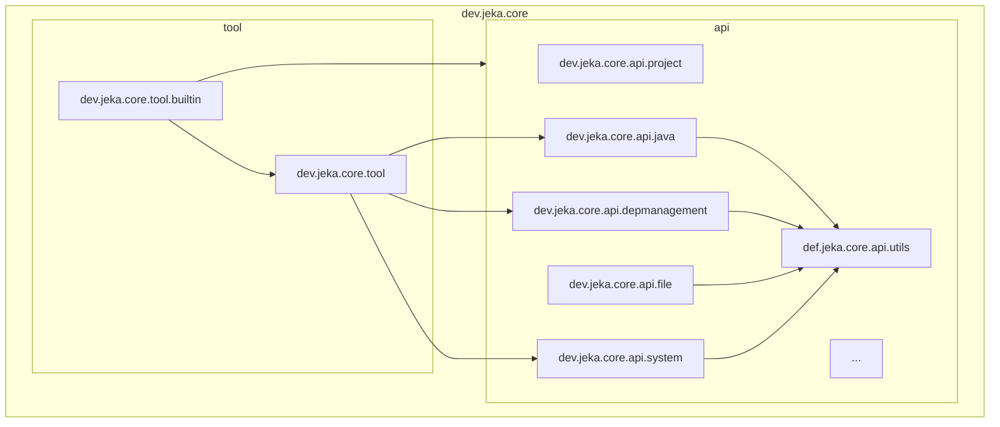

# Under The Hood

Jeka consists of a single zero-dependency JAR file, along with two shell scripts (one Powershell script for Windows and one Bash script for Linux/macOS).

## Inside the Jeka JAR

The Jeka JAR is structured as follows:

- `dev.jeka.core.tool` package:

    Contains classes for running Java externally, including the `dev.jeka.core.tool.Main` class and the component model.

- `dev.jeka.core.tool.builtin` package: 

     Contains *KBeans* bundled with JeKa, as `ProjectKBean`, `DockerKBean` or `NativeKBean`.

- `dev.jeka.core.api` package:

  Includes libraries for building projects. These classes can be easily used outside Jeka and embedded in your product.    

