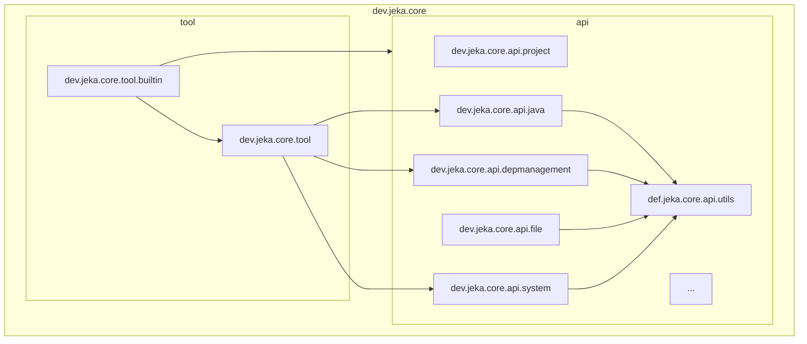

# Under The Hood

Jeka consists of a single zero-dependency JAR file, along with two shell scripts (one Powershell script for Windows and one Bash script for Linux/macOS).

## Inside the Jeka JAR

The Jeka JAR is structured as follows:

- `dev.jeka.core.tool` package:

    Contains classes for running Java externally, including the `dev.jeka.core.tool.Main` class and the component model.

- `dev.jeka.core.tool.builtin` package: 

     Contains *KBeans* bundled with JeKa. These KBeans are used for building classic or cloud-native Java app. 
     Here are some example among other

     - `ProjectKBean`: Build JVM projects.
     - `DockerKBean`: Create JVM-based or native-based Docker images.
     - `NativeKBean`: Create native executables from a project.

- `dev.jeka.core.api` package:

    Contains the libraries needed to build projects. These classes can be conveniently used outside of Jeka, embedded in your own product.
    

